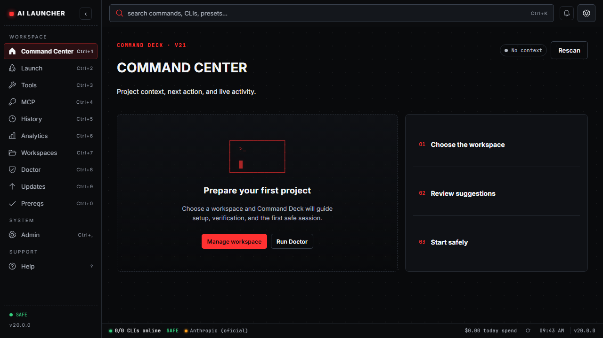
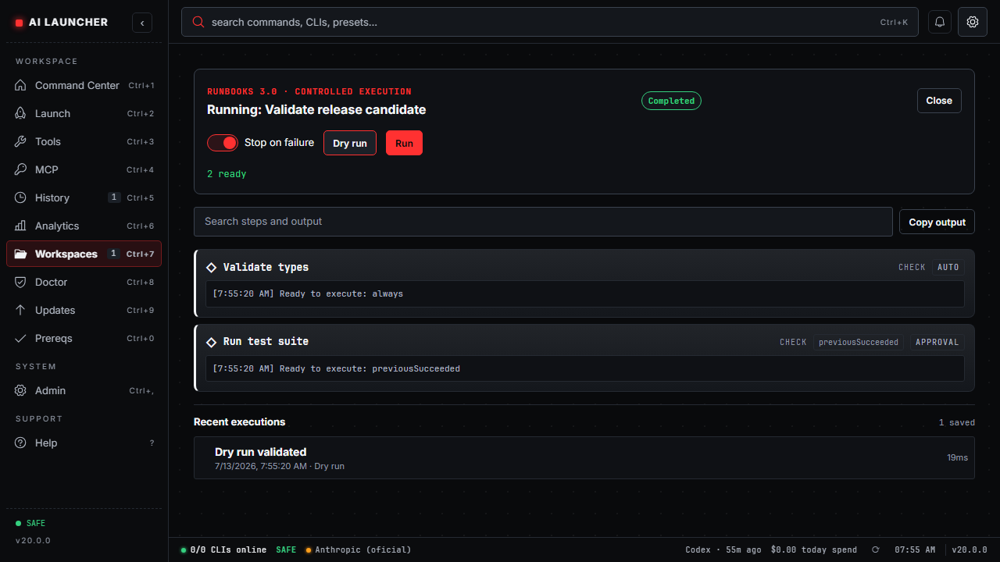
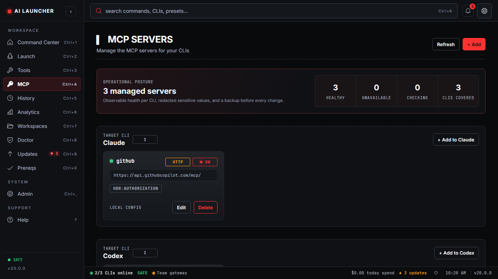
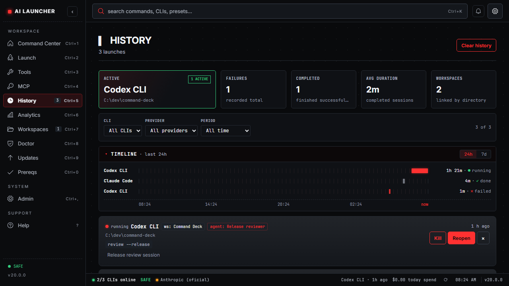
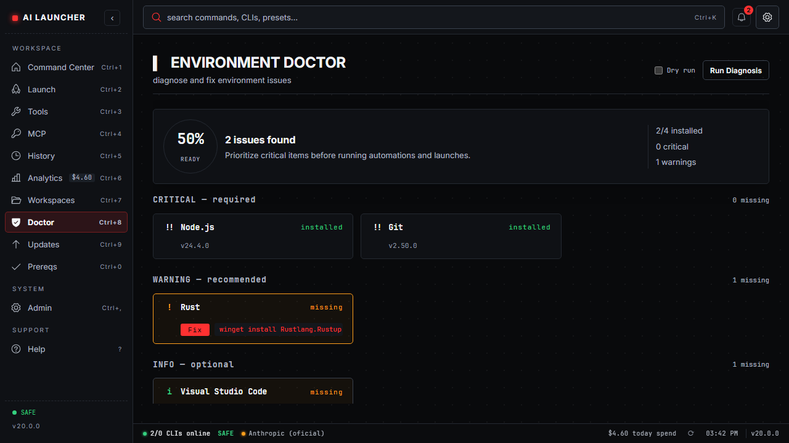
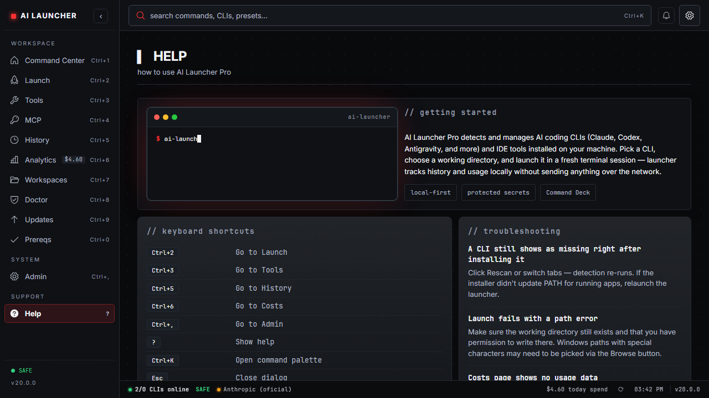

> 🇺🇸 English | [🇧🇷 Português (Brasil)](./README.pt-BR.md)

<div align="center">


**One desktop app to detect, install, launch, update and track all your AI coding tools.**

[](./LICENSE)
[](https://github.com/HelbertMoura/ai_launcher/releases)
[](https://github.com/HelbertMoura/ai_launcher/releases)


</div>

---

## Features

| | Feature | Description |
|---|---------|-------------|
| :rocket: | **CLI Launcher** | Detect, install and launch Claude Code, Codex, Gemini CLI, Antigravity, Qwen, Crush, Droid, Kilocode, OpenCode and more |
| :wrench: | **Tools Manager** | Manage VS Code, Cursor, Windsurf, JetBrains AI and custom IDEs |
| :arrow_up: | **Updates Hub** | Dedicated tab for CLI, tool and prerequisite updates with one-click install |
| :moneybag: | **Cost Tracking** | Per-provider spend tracking with daily and monthly breakdowns |
| :clipboard: | **Launch History** | Full session log with reopen, descriptions, status badges and duration tracking |
| :mag: | **Prerequisites Check** | Verify Node, npm, Bun, Python, Rust, Cargo, Git, Docker and more |
| :electric_plug: | **Providers** | Anthropic, Z.AI, MiniMax, Moonshot, Qwen, OpenRouter + custom endpoints with API test button |
| :art: | **Full Customization** | Dark/Light theme, 5 accent colors, 5 mono fonts, CLI overrides |
| :globe_with_meridians: | **i18n** | English and Portuguese (Brazil) with instant toggle |
| :keyboard: | **Keyboard-First** | `Ctrl+K` palette, `Ctrl+1-9/0` tab nav, `Ctrl+,` admin, `?` help |
| :compass: | **Command Center** | Home base with workspace readiness, quick launch, sessions, project intelligence and setup actions |
| :brain: | **Project Intelligence** | Detect stack, suggest CLIs/runbooks and create safe `.ailauncher.json` project profiles |
| :busts_in_silhouette: | **Agent Profiles** | Save agent-specific CLI, args and provider presets for repeatable workspace launches |
| :link: | **Project MCP** | Match project-required MCP servers, show missing/healthy state and apply validated presets |
| :lock: | **Privacy-First** | Everything stays local -- no telemetry, no cloud sync |
| :office: | **Workspace Profiles** | Group configs by repo, team or context for one-click switching |
| :jigsaw: | **Agent Runbooks** | Automated environment setup sequences for AI agent workflows |
| :shield: | **Budget Guard** | Local cost limits per provider with alerts at configurable thresholds |
| :stethoscope: | **Environment Doctor** | Diagnose and repair broken dev environments with guided fixes |
| :eye: | **Safe Command Preview** | Review executable, args, env and risk level before running custom commands |
| :arrows_counterclockwise: | **Self-Updater** | In-app update checks, download with progress, checksum validation |

## Screenshots

<div align="center">

### Command Deck v21 · Trust, flow and visual clarity

| Command Center | Runbooks Command Deck | MCP Hub |
|:---:|:---:|:---:|
|  |  |  |

### Sessions timeline · Doctor readiness · Help

| Sessions Timeline | Doctor Readiness | Help & Support |
|:---:|:---:|:---:|
|  |  |  |

</div>

## Quick Start

### Install (Windows)

Download the installer from the [latest GitHub release](https://github.com/HelbertMoura/ai_launcher/releases/latest):

- `.exe` (NSIS) — recommended for most users.
- `.msi` — useful for managed or administrative deployments.

> **Winget and Chocolatey are not available yet.** The planned package IDs are `DevManiacs.AILauncher` and `ai-launcher`, but installation commands using them will fail until the packages are published.

> SmartScreen may warn on unsigned builds -- click **More info, then Run anyway**.

### Build from Source

**Prerequisites:** Node.js 20.19+ or 22.12+, Rust stable, and Visual Studio Build Tools with **Desktop development with C++**.

```bash
git clone https://github.com/HelbertMoura/ai_launcher.git
cd ai_launcher
npm ci
npm run tauri build
```

The installers are generated in:

- MSI: `src-tauri/target/release/bundle/msi/`
- EXE (NSIS): `src-tauri/target/release/bundle/nsis/`

## Keyboard Shortcuts

| Shortcut | Action |
|----------|--------|
| `Ctrl+K` | Open rich command palette |
| `Ctrl+1` | Command Center |
| `Ctrl+2` | Launch tab |
| `Ctrl+3` | Tools tab |
| `Ctrl+4` | MCP tab |
| `Ctrl+5` | History tab (sessions dashboard) |
| `Ctrl+6` | Analytics tab |
| `Ctrl+7` | Workspaces tab |
| `Ctrl+8` | Doctor tab (environment diagnosis) |
| `Ctrl+9` | Updates tab |
| `Ctrl+0` | Prerequisites tab |
| `Ctrl+,` | Admin tab |
| `?` | Help tab |
| `Esc` | Close dialog |

## Surfaces

The app has 11 main surfaces accessible from the sidebar:

| Tab | What it does |
|-----|-------------|
| **Command Center** | Start from the active workspace, launch agents, inspect readiness, sessions and project intelligence |
| **Launch** | Scan for AI CLIs, install missing ones, launch with custom directory and args |
| **Tools** | Detect and manage IDEs — install missing tools with one click |
| **MCP** | Manage Claude/Codex/Gemini MCP configs with backups, catalog presets and health checks |
| **History** | Sessions dashboard with filters, replay, kill and workspace/agent badges |
| **Analytics** | Per-provider cost breakdown — today and monthly totals with token tracking |
| **Workspaces** | Profiles, Agent Profiles, Budget, Doctor summary, Runbooks and Recent Sessions |
| **Doctor** | Environment health check with severity (critical/warning/info) + guided fixes |
| **Updates** | Central hub for CLI, tool and prerequisite updates — update all or individually |
| **Prereqs** | System health check — Node, npm, Bun, Python, Rust, Git, Docker, Terminal |
| **Admin** | Providers (with API test), profiles, appearance, CLI overrides, custom IDEs |
| **Help** | Shortcuts, FAQ, animated terminal demo, welcome tour replay |

## 🚀 What's new in v21 — Trust & Flow / Command Deck

- **Trust Foundation** — provider secrets fail closed into Windows Credential Manager, with safer legacy migration and storage guardrails.
- **Command Deck visual system** — clearer app shell, typography, density/accent controls, light/dark/high-contrast baselines and keyboard-first layouts.
- **Command Center 2.0** — guided empty states, project readiness, `.ailauncher.json` review, active sessions and safer primary actions.
- **Runbooks 3.0** — dry-run, approvals, retry/resume, real stop, bounded output and workspace activity timeline.
- **Operational pages refreshed** — Launcher, Workspaces, History, MCP, Updates, Admin, Analytics, Doctor, Prereqs, Onboarding and Help.
- **Release readiness** — critical workflow E2E, visual regression matrix, capability/storage audits and packaged Windows smoke harness.

Read the [v21 release notes](./docs/releases/v21.0.0.md) and [v21 PRD](./docs/PRD-v21.md) for the Trust & Flow scope.

<details><summary>v20 highlights</summary>

- **Command Center** — default home with active workspace, launch, readiness cards, sessions and project intelligence
- **Project Intelligence** — stack detector for Node/React/Vite/Tauri/Rust/Python/Go/Docker/MCP plus `.ailauncher.json` creation
- **Runbooks 2.0** — local presets, conditional steps and persisted execution timelines
- **Project MCP** — match required MCP servers from project profile and show healthy/missing state
- **Agent Profiles** — reusable agent launch presets with CLI, args and provider
- **Sessions 2.0** — dashboard metrics, persisted filters, replay through the shared launch flow and confirmed kill
- **Backup Trust** — export manifest, recursive secret redaction and import preview before local restore
- **Updater Trust** — visible release trust chain plus `latest.json` validation in release audit

</details>

<details><summary>v16 highlights</summary>

- **Agent Analytics** — 30-day cost series, top projects, model breakdowns and CSV/JSON export
- **Inbox Center** — local update, budget, doctor and session notifications with read state
- **Accessibility AA pass** — contrast fixes, structured axe coverage and safer focus behavior
- **MCP Manager** — manage Claude, Codex and Gemini MCP configs with backups and health checks
- **Theme Foundry** — Phosphor, Midnight and High Contrast themes plus token contract tests
- **Project Profiles** — `.ailauncher.json` can prefill CLI, provider, directory and env per repo
- **Workspace Profiles** — group configs by repo, team or context with one-click switching

</details>

### 🐛 Critical fix (affected v13/v14)

The **Install** button in Prereqs, **Fix** button in Doctor, and **Install prereq** in Updates **did nothing on click** in prior versions. Fixed by adding a canonical `key` field to `CheckResult` and a real install button in `PrereqCard`.

<details><summary>v14 highlights</summary>

- **Autostart + global hotkey** -- launch with Windows, focus from anywhere
- **Pinned dirs + session templates** -- one-click relaunch for your favorite setups
- **History filters, usage export, desktop notifications** -- full observability
- **Free-form accent color picker** -- any hex, not just 5 presets
- **Backend modularized** -- `main.rs` from 3105 to ~120 lines, typed errors, unit tests
- **CI quality gates** -- tsc, vitest, clippy, cargo audit, Playwright E2E on every PR

</details>

<details><summary>v13 highlights</summary>

- **New minimalist icon** — Hex Hub design in red, clean and recognizable at any size
- **Provider persistence in history** — Reopening a Claude session now restores the exact provider used
- **Recent directories dropdown** — Last 10 directories per CLI shown on focus for quick selection
- **Screenshots in docs** — Full gallery of all app surfaces in the README

</details>

<details><summary>v12.5 highlights</summary>

- Updates tab — Dedicated surface for CLI, tool and prerequisite updates
- Install from cards — Install missing CLIs and tools directly from tabs
- History improvements — Reopen sessions, descriptions, status badges, duration tracking
- Test API button — Test provider connections from Admin with latency display
- Official brand icons — Real vendor logos from LobeHub Icons and devicons
- Welcome screen — DevManiacs branding, guided tour, "always show" option

</details>

## Tech Stack

| Layer | Technology |
|-------|-----------|
| Frontend | React 19 + TypeScript 6 + Vite |
| Backend | Rust (Tauri v2) |
| Styling | CSS Custom Properties (token system) |
| i18n | i18next 24 |
| Icons | Official brand logos (LobeHub Icons, devicons) |
| Build | Tauri CLI -- `.msi` + `.exe` (NSIS) |
| Distribution | GitHub Releases · Winget (🚧 coming soon) · Chocolatey (🚧 coming soon) |

## Contributing

Fork the repo, create a feature branch, open a PR against `main`. See [CONTRIBUTING.md](./CONTRIBUTING.md) for setup, conventions and the PR checklist.

## License

MIT — see [LICENSE](./LICENSE).

## Credits

- **Author:** Helbert Moura — [DevManiac's](https://github.com/HelbertMoura)
- **Icons** — [LobeHub Icons](https://github.com/lobehub/lobe-icons), [devicons](https://github.com/devicons/devicon)
- Brand names and trademarks belong to their respective owners.

---

<div align="center">

**[Download](https://github.com/HelbertMoura/ai_launcher/releases)** · **[Report Bug](https://github.com/HelbertMoura/ai_launcher/issues)** · **[Request Feature](https://github.com/HelbertMoura/ai_launcher/issues)**

</div>
