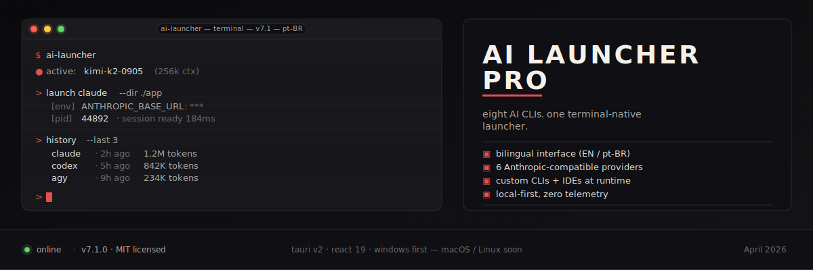

<div align="center">
  

  <br />

  <h1>AI Launcher Pro v8.0</h1>

  <p>
    <strong>The friendly dashboard for every AI coding CLI.</strong>
  </p>

  <p>
    Eight built-in CLIs. Six Anthropic-compatible providers. Custom CLIs with image upload support. 100% Bilingual. Local-first. Zero telemetry.
  </p>

  <p>
    <a href="https://github.com/HelbertMoura/ai_launcher/releases/latest">
      
    </a>
    <a href="https://github.com/HelbertMoura/ai_launcher/releases">
      
    </a>
    <a href="https://github.com/HelbertMoura/ai_launcher/blob/main/LICENSE">
      
    </a>
    <a href="https://github.com/HelbertMoura/ai_launcher/stargazers">
      
    </a>
    
    
  </p>
</div>

<hr />

**Language:** English · [Português](./README.pt-BR.md)

**Platforms:** Windows ✅ · macOS 🔜 · Linux 🔜

<br />

## What's new in v8.0 (The Friendly Dashboard Update)

AI Launcher Pro v8.0 shifts away from the strict "Terminal Dramático" look to a far more accessible, spacious, and modern **Data-Dense Dashboard**. 

- **Custom Icons (PNG/JPG):** We heard you! You are no longer restricted to emojis or minimal SVGs for custom CLIs. You can now upload, crop, and resize any image to use as your tool icon.
- **Flawless i18n:** Zero hardcoded strings. English and Brazilian Portuguese translations flow perfectly through flexible, fluid layouts that adapt to varying string lengths without breaking.
- **Revamped Visuals:** Replaced the rigid wireframe look with a beautiful, high-contrast (WCAG AA compliant) UI that embraces both Fira Code (for data) and Fira Sans (for readability).
- **Brand New Built-In Icons:** Official CLIs (Claude, Cursor, Gemini, etc.) now feature colorful and highly recognizable custom icons.

<br />

## What it is

AI Launcher Pro is a Tauri v2 desktop app that consolidates every AI coding CLI worth using — Claude Code, Codex, Gemini, Qwen, Kilo Code, OpenCode, Crush, Factory Droid — behind one keyboard-first surface. Detect what's installed, install what isn't, point any Anthropic-compatible CLI at a different backend, track every run, and do it all from a beautifully designed hub.

It fits the way working developers already move. You open it with a shortcut, the launcher card tells you the CLI's version and status at a glance, you pick a working directory, hit `Launch`, and a real Windows Terminal session spawns with the correct env vars injected. The launcher keeps a git-log-style history, aggregates token spend into a daily budget, and never phones home. No accounts to create. No login screen.

<br />

## Highlights

### Launch & manage
- 8 built-in AI CLIs — Claude Code, Codex, Gemini, Qwen, Kilo Code, OpenCode, Crush, Factory Droid
- Add your own CLI easily — with new PNG/JPG icon upload capabilities
- Git-log-style history with inline re-run, copy-args, and provider attribution
- 9 keyboard-first tabs — `⌘K` palette, `⌘⇧1-4` primary tabs, `⌘/` help, `⌘1-9` preset launches

### Multi-provider
- 6 Anthropic-compatible providers seeded: **Anthropic**, **Z.AI (GLM)**, **MiniMax**, **Moonshot / Kimi**, **Qwen / DashScope**, **OpenRouter**
- Switch the active provider in one click from Admin → Providers
- Per-profile model overrides and daily budget tracking
- Custom profiles for any Anthropic-compatible endpoint

### UX & Customization
- **Friendly Dashboard Design** — Modern typography (Fira Sans + Fira Code), slate/blue palette, and soft hover states
- **Bilingual Interface** — Seamless switching between English and Portuguese (pt-BR) with fluid layouts
- **Live Cost Aggregation** with daily budget bars and 7-day sparklines
- **Advanced Customization:** Override any built-in CLI's display name and upload your own image icons

<br />

## Install

### End users

Grab the latest `.msi` or `.exe` from the [releases page](https://github.com/HelbertMoura/ai_launcher/releases/latest). 

*Note for Windows users:* SmartScreen may warn on unsigned builds. Click **More info → Run anyway**.

### From source

```bash
git clone https://github.com/HelbertMoura/ai_launcher.git
cd ai_launcher
npm install
npm run tauri dev                             # hot-reload dev
npm run tauri build                           # standard installers
$env:VITE_ADMIN_MODE='1'; npm run tauri build # admin always-on build (Admin Full Local)
```

**Prerequisites:** Node 18+, [Rust stable](https://rustup.rs/), Windows 10 or 11, Visual Studio Build Tools with the **Desktop development with C++** workload.

<br />

## License

MIT. See [LICENSE](./LICENSE). Copyright © 2026 Helbert Moura | DevManiac's.
