> 🇺🇸 English | [🇧🇷 Português (Brasil)](./README.pt-BR.md)

<div align="center">


**One desktop app to detect, install, launch, update and track all your AI coding tools.**

[](./LICENSE)
[](https://github.com/HelbertMoura/ai_launcher/releases)
[](https://github.com/HelbertMoura/ai_launcher/releases)


</div>

---

## Features

| | Feature | Description |
|---|---------|-------------|
| :rocket: | **CLI Launcher** | Detect, install and launch Claude Code, Codex, Gemini CLI, Qwen, Crush, Droid, Kilocode, OpenCode and more |
| :wrench: | **Tools Manager** | Manage VS Code, Cursor, Windsurf, Google Antigravity, JetBrains AI and custom IDEs |
| :arrow_up: | **Updates Hub** | Dedicated tab for CLI, tool and prerequisite updates with one-click install |
| :moneybag: | **Cost Tracking** | Per-provider spend tracking with daily and monthly breakdowns |
| :clipboard: | **Launch History** | Full session log with reopen, descriptions, status badges and duration tracking |
| :mag: | **Prerequisites Check** | Verify Node, npm, Bun, Python, Rust, Cargo, Git, Docker and more |
| :electric_plug: | **Providers** | Anthropic, Z.AI, MiniMax, Moonshot, Qwen, OpenRouter + custom endpoints with API test button |
| :art: | **Full Customization** | Dark/Light theme, 5 accent colors, 5 mono fonts, CLI overrides |
| :globe_with_meridians: | **i18n** | English and Portuguese (Brazil) with instant toggle |
| :keyboard: | **Keyboard-First** | `Ctrl+K` palette, `Ctrl+1-6` tab nav, `Ctrl+,` admin, `?` help |
| :lock: | **Privacy-First** | Everything stays local -- no telemetry, no cloud sync |
| :office: | **Workspace Profiles** | Group configs by repo, team or context for one-click switching |
| :jigsaw: | **Agent Runbooks** | Automated environment setup sequences for AI agent workflows |
| :shield: | **Budget Guard** | Local cost limits per provider with alerts at configurable thresholds |
| :stethoscope: | **Environment Doctor** | Diagnose and repair broken dev environments with guided fixes |
| :eye: | **Safe Command Preview** | Review executable, args, env and risk level before running custom commands |
| :arrows_counterclockwise: | **Self-Updater** | In-app update checks, download with progress, checksum validation |

## Screenshots

<div align="center">

### Command Deck 2.0 · Dark, Light, Amber, Glacier

| CLI Launcher | Tools | Rich Command Palette |
|:---:|:---:|:---:|
| 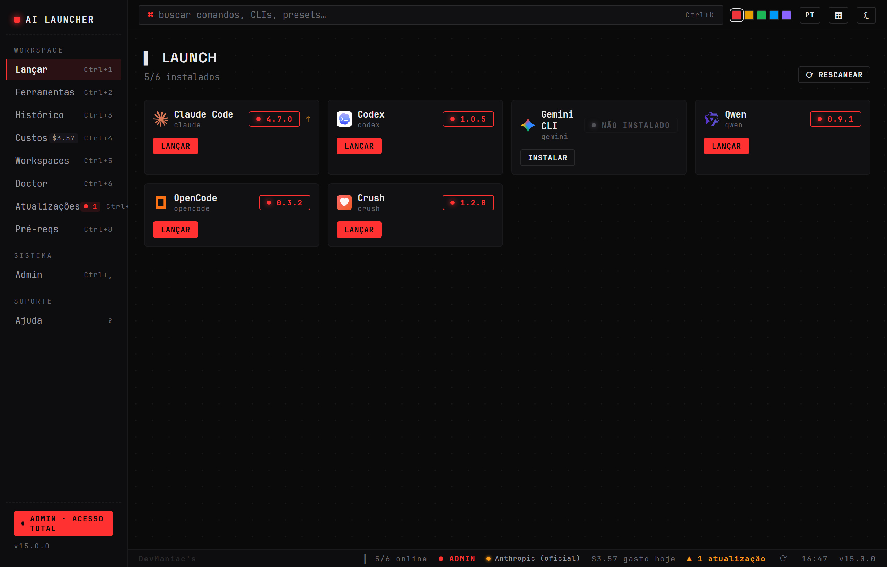 | 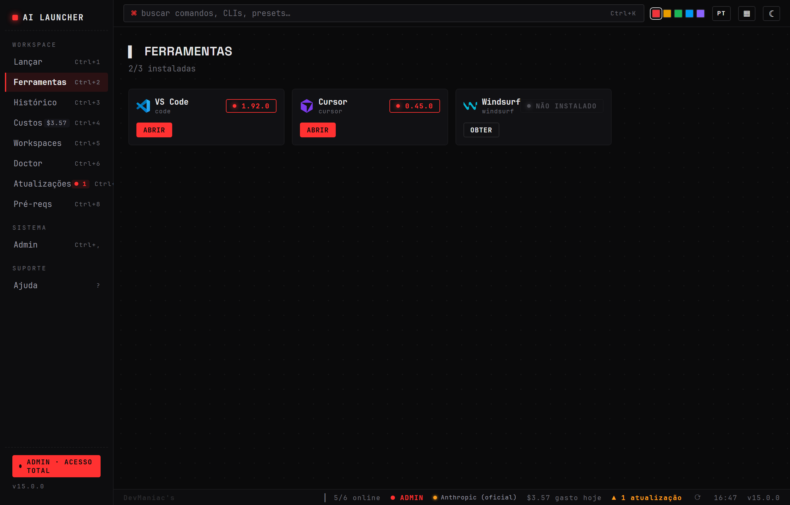 | 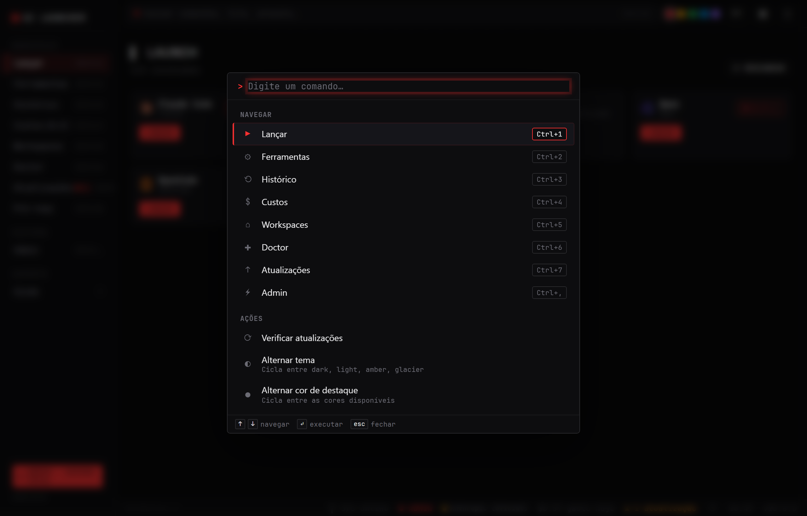 |

### Workspace bento · History waterfall · Environment Doctor

| Workspace Profiles | History Timeline | Environment Doctor |
|:---:|:---:|:---:|
| 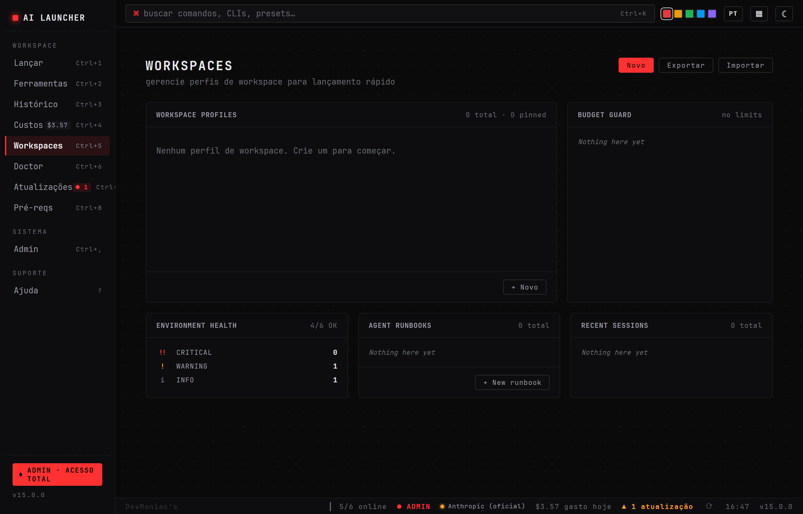 | 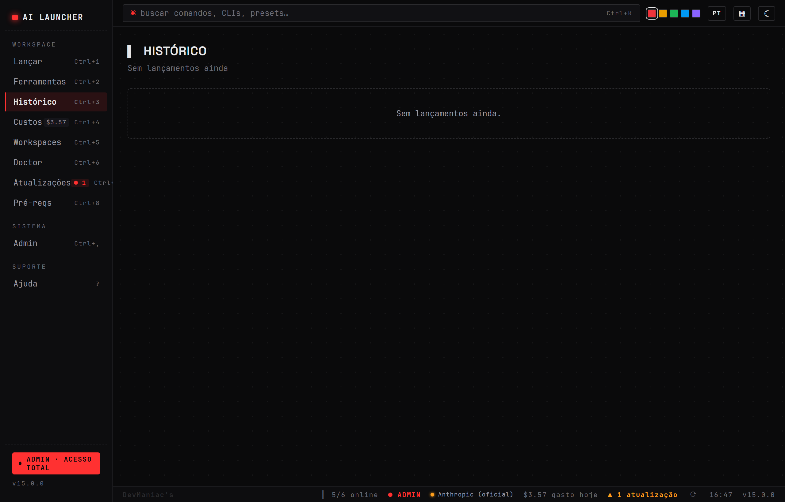 | 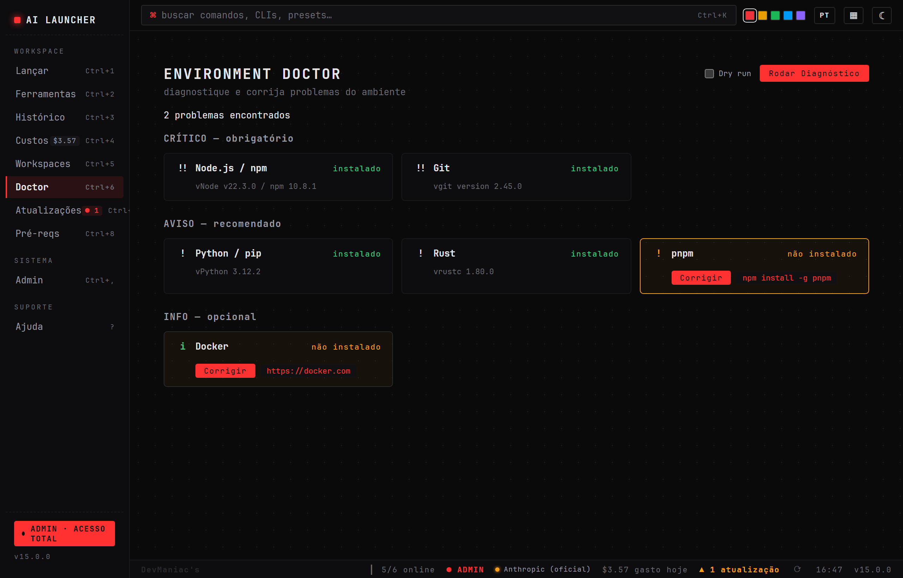 |

### Updates · Costs · Theme variants

| Updates Hub | Costs Tracking | 4 Theme Variants |
|:---:|:---:|:---:|
| 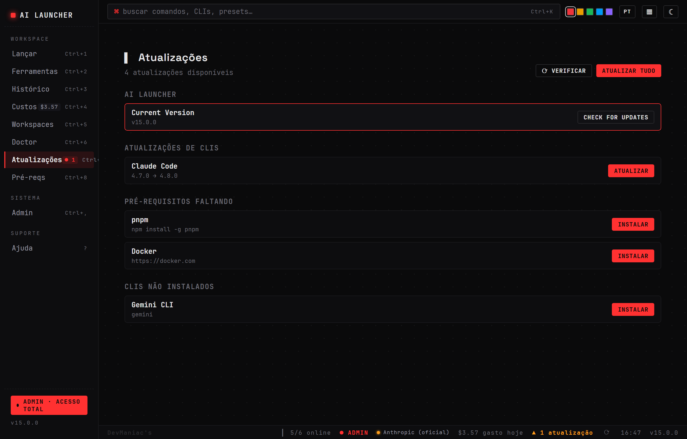 | 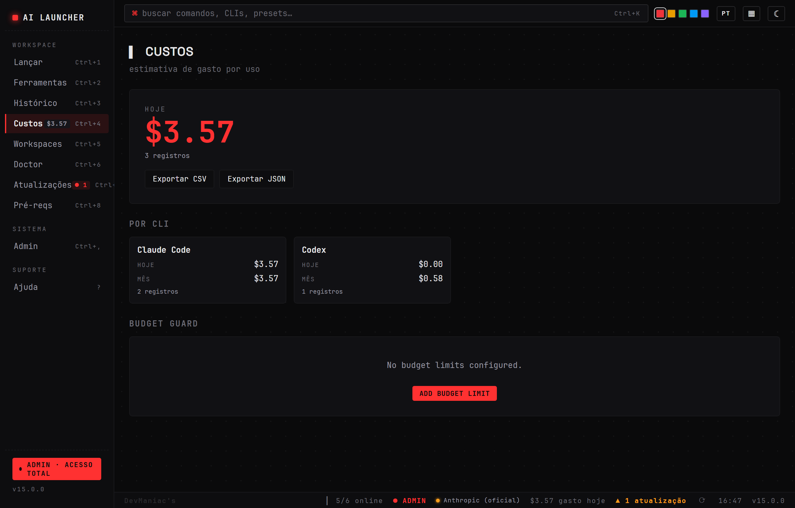 | 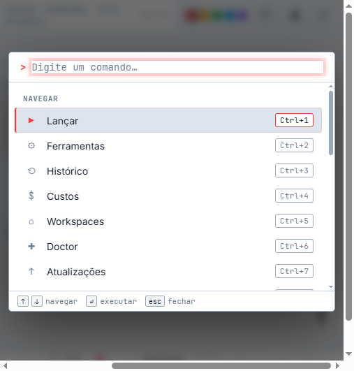 |

| Light Theme | Amber (CRT Retro) | Glacier + Compact Density |
|:---:|:---:|:---:|
| 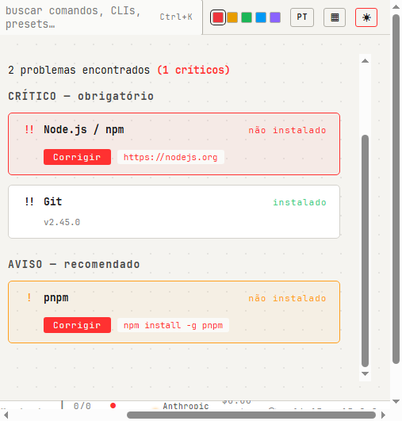 | 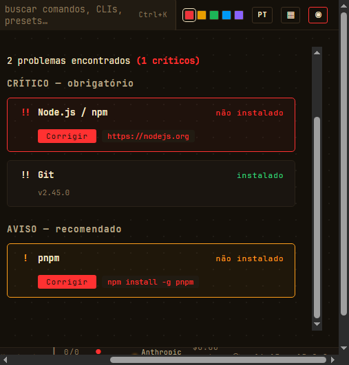 | 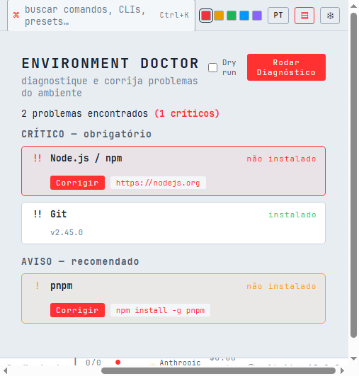 |

</div>

## Quick Start

### Install (Windows)

<!-- Winget and Chocolatey — coming soon after signed release -->

```bash
# Option 1: Winget (recommended)
winget install DevManiacs.AILauncher

# Option 2: Chocolatey
choco install ai-launcher -y

# Option 3: Manual download
# Grab the .msi or .exe installer from the latest release:
# https://github.com/HelbertMoura/ai_launcher/releases
```

> SmartScreen may warn on unsigned builds -- click **More info, then Run anyway**.

### Build from Source

**Prerequisites:** Node 20+, Rust stable, Visual Studio Build Tools with **Desktop development with C++**.

```bash
git clone https://github.com/HelbertMoura/ai_launcher.git
cd ai_launcher
npm install
npm run tauri build
```

The `.msi` lands in `src-tauri/target/release/bundle/msi/`.

## Keyboard Shortcuts

| Shortcut | Action |
|----------|--------|
| `Ctrl+K` | Open rich command palette |
| `Ctrl+1` | Launch tab |
| `Ctrl+2` | Tools tab |
| `Ctrl+3` | History tab (timeline waterfall) |
| `Ctrl+4` | Costs tab |
| `Ctrl+5` | Workspaces tab (bento grid) |
| `Ctrl+6` | Doctor tab (environment diagnosis) |
| `Ctrl+7` | Updates tab |
| `Ctrl+8` | Prerequisites tab |
| `Ctrl+,` | Admin tab |
| `?` | Help tab |
| `Esc` | Close dialog |

## Surfaces

The app has 10 main surfaces accessible from the sidebar:

| Tab | What it does |
|-----|-------------|
| **Launch** | Scan for AI CLIs, install missing ones, launch with custom directory and args |
| **Tools** | Detect and manage IDEs — install missing tools with one click |
| **History** | Terminal-style waterfall timeline + session log with reopen and status dots |
| **Costs** | Per-CLI cost breakdown — today and monthly totals with token tracking |
| **Workspaces** | Bento grid: Profiles, Budget, Doctor summary, Runbooks, Recent Sessions |
| **Doctor** | Environment health check with severity (critical/warning/info) + guided fixes |
| **Updates** | Central hub for CLI, tool and prerequisite updates — update all or individually |
| **Prereqs** | System health check — Node, npm, Bun, Python, Rust, Git, Docker, Terminal |
| **Admin** | Providers (with API test), profiles, appearance, CLI overrides, custom IDEs |
| **Help** | Shortcuts, FAQ, animated terminal demo, welcome tour replay |

## 🚀 What's new in v15 — AI Ops Command Center

- **Workspace Profiles** — group configs by repo, team or context with one-click switching
- **Agent Runbooks** — automated setup sequences for AI agent environments
- **Provider Budget Guard** — local cost limits per provider with configurable alerts
- **Environment Doctor** — diagnose and repair broken dev environments with guided fixes
- **Safe Command Preview** — review risk level before running custom commands
- **Self-Updater** — in-app update checks, download progress, checksum validation
- **Unified Launch Profiles** — presets and session templates merged into one model
- **Session Lifecycle** — real process status tracking (starting/running/completed/failed)
- **4 Theme variants** — dark, light, amber (CRT retro), glacier (cool blue) with `☾` cycle
- **Rich Command Palette** — categories, icons, shortcut chips, recent sessions with relaunch
- **Bento Workspace** — editorial layout with 5 click-through cards
- **History Waterfall** — horizontal terminal-native timeline (24h / 7d toggle)
- **Density Toggle** — compact/comfortable via `▦` button in the top bar
- **Secure Secrets** — API keys via DPAPI (Windows) with transparent fallback
- **Command Deck 2.0** — clean hierarchy, zero native `alert()`, focus trap in dialogs
- **Phosphor Icons** foundation — consistent icon set across the app

### 🐛 Critical fix (affected v13/v14)

The **Install** button in Prereqs, **Fix** button in Doctor, and **Install prereq** in Updates **did nothing on click** in prior versions. Fixed by adding a canonical `key` field to `CheckResult` and a real install button in `PrereqCard`.

<details><summary>v14 highlights</summary>

- **Autostart + global hotkey** -- launch with Windows, focus from anywhere
- **Pinned dirs + session templates** -- one-click relaunch for your favorite setups
- **History filters, usage export, desktop notifications** -- full observability
- **Free-form accent color picker** -- any hex, not just 5 presets
- **Backend modularized** -- `main.rs` from 3105 to ~120 lines, typed errors, unit tests
- **CI quality gates** -- tsc, vitest, clippy, cargo audit, Playwright E2E on every PR

</details>

<details><summary>v13 highlights</summary>

- **New minimalist icon** — Hex Hub design in red, clean and recognizable at any size
- **Provider persistence in history** — Reopening a Claude session now restores the exact provider used
- **Recent directories dropdown** — Last 10 directories per CLI shown on focus for quick selection
- **Screenshots in docs** — Full gallery of all app surfaces in the README

</details>

<details><summary>v12.5 highlights</summary>

- Updates tab — Dedicated surface for CLI, tool and prerequisite updates
- Install from cards — Install missing CLIs and tools directly from tabs
- History improvements — Reopen sessions, descriptions, status badges, duration tracking
- Test API button — Test provider connections from Admin with latency display
- Official brand icons — Real vendor logos from LobeHub Icons and devicons
- Welcome screen — DevManiacs branding, guided tour, "always show" option

</details>

## Tech Stack

| Layer | Technology |
|-------|-----------|
| Frontend | React 19 + TypeScript 6 + Vite |
| Backend | Rust (Tauri v2) |
| Styling | CSS Custom Properties (token system) |
| i18n | i18next 24 |
| Icons | Official brand logos (LobeHub Icons, devicons) |
| Build | Tauri CLI -- `.msi` + `.exe` (NSIS) |
| Distribution | Winget, Chocolatey, GitHub Releases |

## Contributing

Fork the repo, create a feature branch, open a PR against `main`. See [CONTRIBUTING.md](./CONTRIBUTING.md) for setup, conventions and the PR checklist.

## License

MIT — see [LICENSE](./LICENSE).

## Credits

- **Author:** Helbert Moura — [DevManiac's](https://github.com/HelbertMoura)
- **Icons** — [LobeHub Icons](https://github.com/lobehub/lobe-icons), [devicons](https://github.com/devicons/devicon)
- Brand names and trademarks belong to their respective owners.

---

<div align="center">

**[Download](https://github.com/HelbertMoura/ai_launcher/releases)** · **[Report Bug](https://github.com/HelbertMoura/ai_launcher/issues)** · **[Request Feature](https://github.com/HelbertMoura/ai_launcher/issues)**

</div>
