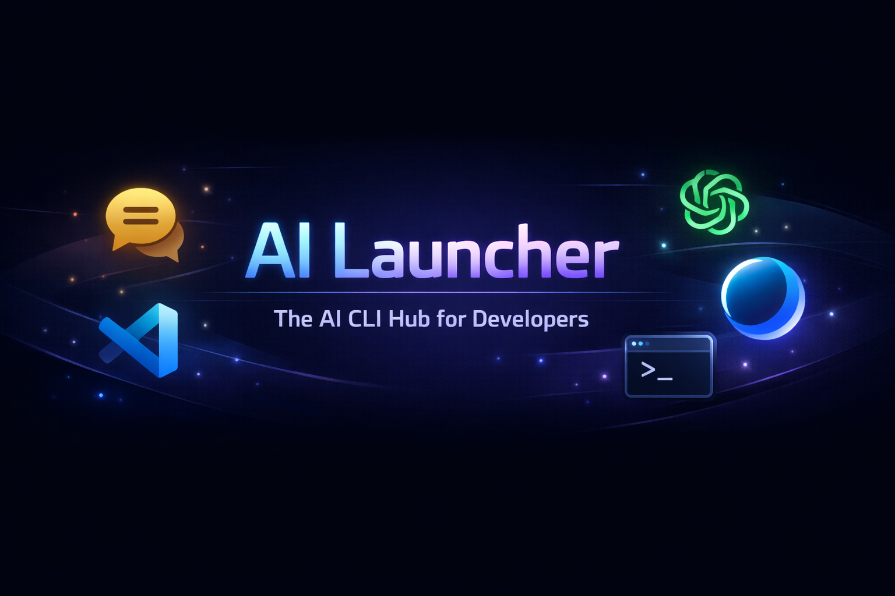

<div align="center">
  

  <br />
  <br />

  <h1>🚀 AI Launcher</h1>

  <p>
    <strong>Your ultimate desktop hub for AI coding CLIs. Built for speed, flexibility, and productivity.</strong>
  </p>

  <p>
    <a href="https://github.com/HelbertMoura/ai_launcher/releases/latest">
      
    </a>
    <a href="https://github.com/HelbertMoura/ai_launcher/actions/workflows/build.yml">
      
    </a>
    <a href="https://github.com/HelbertMoura/ai_launcher/releases">
      
    </a>
    
  </p>
  <p>
    <a href="https://github.com/HelbertMoura/ai_launcher/blob/main/LICENSE">
      
    </a>
    <a href="https://github.com/HelbertMoura/ai_launcher/stargazers">
      
    </a>
    <a href="https://github.com/HelbertMoura/ai_launcher/network/members">
      
    </a>
    <a href="https://github.com/HelbertMoura/ai_launcher/issues">
      
    </a>
    <a href="https://github.com/HelbertMoura/ai_launcher/blob/main/.github/dependabot.yml">
      
    </a>
  </p>

  <h3>
    <a href="#-português">🇧🇷 Português</a>
    <span> | </span>
    <a href="#-english">🇬🇧 English</a>
  </h3>
</div>

<hr />

## 🇧🇷 Português

O **AI Launcher** é o seu hub definitivo e de código aberto para Command Line Interfaces (CLIs) de Inteligência Artificial no Windows. Descubra, instale, atualize e gerencie suas ferramentas de IA favoritas — como **Claude Code, Codex, Gemini, Qwen, Kilo Code, OpenCode, Crush e Droid** — tudo a partir de uma interface moderna, rápida e incrivelmente intuitiva.

Além de gerenciar suas IAs, ele oferece atalhos de um clique para editores populares como **VS Code, Cursor, Windsurf e AntGravity**. Diga adeus às telas pretas piscando, buscas intermináveis por comandos `npm install -g` específicos e dores de cabeça com a configuração de variáveis de ambiente. Tudo está aqui, em um único lugar! ✨

Construído com ❤️ usando **Tauri v2**, **React 18** e **Rust**, com foco em extrema otimização para Windows 10 e 11.

<br />

### ✨ Principais Funcionalidades

- 📦 **Instalação e Atualização Sem Complicações**
  O AI Launcher detecta o que falta no seu ambiente. Ele executa `npm install -g` ou `pip install` em segundo plano com uma interface limpa que mostra o progresso em tempo real. O sistema compara suas versões locais com as mais recentes das CLIs, IDEs e pré-requisitos (Node.js, Python, Git, Rust).

- 🚀 **Execução Inteligente**
  Abra suas CLIs diretamente no Windows Terminal (se disponível), com fallback automático para PowerShell 7 ou `cmd`. A melhor parte? Ele **aplica automaticamente as flags de permissão corretas** (como `--dangerously-skip-permissions` ou `--yolo`) para que você foque apenas no código.

- 📊 **Rastreamento Avançado (Orquestrador)**
  Mantenha um histórico detalhado de execuções por projeto, consolide o uso de tokens (ex.: Claude Code) e gerencie a execução de múltiplas CLIs lado a lado no mesmo diretório através da poderosa aba **Orquestrador**.

<br />

### 🤖 CLIs de IA Suportadas

| CLI de IA | Comando Base de Instalação | Flag Automática Injetada |
| :--- | :--- | :--- |
| **Claude Code** | `npm install -g @anthropic-ai/claude-code` | `--dangerously-skip-permissions` |
| **Codex** | `npm install -g @openai/codex` | `--dangerously-bypass-approvals-and-sandbox` |
| **Gemini CLI** | `npm install -g @google/gemini-cli` | `--yolo` |
| **Qwen** | `npm install -g qwen-ai` | `--yolo` |
| **Kilo Code** | `pip install kilo-code` | `--yolo` |
| **Crush** | `npm install -g crush-cli` | `--yolo` |
| **Droid** | `npm install -g droid` | — |
| **OpenCode** | `npm install -g opencode-ai` | — |

<br />

### 🛠 IDEs & Editores Compatíveis

Suporte nativo e detecção automática para: **VS Code, Cursor, Windsurf, AntGravity, Claude Desktop e Codex Desktop**. O launcher identifica as instalações e permite que você abra o diretório de trabalho atual na sua IDE favorita com apenas um clique.

<br />

### ⚙️ Como Compilar e Instalar (Recomendado)

Para garantir máxima segurança e evitar alertas incômodos do Windows SmartScreen (muito comuns em executáveis que não são assinados com certificados pagos), recomendamos fortemente que você construa o **AI Launcher** diretamente a partir do código-fonte. É um processo rápido e transparente!

Por ser totalmente open-source, **você pode compilar seu próprio `.msi` ou `.exe` localmente**. Isso é perfeito para assegurar integridade ou para customizar a ferramenta para as necessidades da sua empresa!

#### Pré-requisitos:
- Node.js 18+
- [Rust (Stable)](https://rustup.rs/)
- Windows 10 ou 11
- Visual Studio Build Tools (Carga de trabalho requerida: **Desenvolvimento para desktop com C++** para compilação do Tauri).

```bash
# 1. Clone o repositório
git clone https://github.com/HelbertMoura/ai_launcher.git
cd ai_launcher

# 2. Instale as dependências Node
npm install

# 3. (Opcional) Execute o ambiente de desenvolvimento (Hot Reload)
npm run tauri dev

# 4. Compile os seus próprios instaladores! (Gera MSI e NSIS)
npm run tauri build
```

🎉 Os instaladores gerados estarão disponíveis em `src-tauri/target/release/bundle/`. Basta executar o `.msi` ou `.exe` gerado para instalar o AI Launcher.

> _**Dica:** Deseja assinar os binários localmente para remover completamente avisos do Windows? Confira os scripts `gen-cert.ps1` e `sign-build.ps1` localizados na pasta `/scripts/`._

<br />

### 🧪 Recursos avançados (v5.0+)

O AI Launcher v5.0 introduz recursos opcionais de power-user que ficam **ocultos por padrão** e só aparecem quando você cria um arquivo `.env.local` com `VITE_ADMIN_MODE=1`. Nenhum desses recursos quebra o fluxo padrão da v4.

- **Providers alternativos (Claude Code)** — Lance o Claude Code apontando para endpoints Anthropic-compatible como **Z.AI (GLM)** ou **MiniMax**, com CRUD completo, teste de conexão e mapeamento automático de modelos (`opus/sonnet → glm-5.1`, `haiku → glm-4.7`).
- **Launch Presets** — Salve combinações CLI + provider + diretório + args como chips clicáveis. Atalhos `Ctrl+1..9` para lançar instantaneamente.
- **Quick Switch** — `Ctrl+P` abre busca fuzzy de providers; alterne sem abrir o painel.
- **Preview (dry-run)** — Veja o comando e as env vars que serão injetadas antes de executar. Exporta script `.bat` reprodutível.
- **Cost-aware tracking** — A aba Custos reestima valores usando os preços configurados no Admin quando o modelo não é reconhecido pela tabela padrão.
- **Budget diário** — Configure um limite por provider e receba alerta quando o gasto do dia ultrapassar.
- **Tray quick-switch** — Submenu no system tray para trocar provider sem abrir a janela principal.

Copie `.env.example` para `.env.local` e remova o `#` da linha `VITE_ADMIN_MODE=1` para ativar.

> **⚠️ Nota MiniMax — regiões**: o seed built-in aponta para o endpoint **internacional**
> (`https://api.minimax.io/anthropic`) e usa o modelo **`MiniMax-M2.7`**. Se você tem conta
> **na China**, edite o perfil no Admin Panel e troque a baseUrl para
> `https://api.minimaxi.com/anthropic`. Chaves:
> [internacional](https://platform.minimax.io/user-center/basic-information/interface-key) ·
> [china](https://platform.minimaxi.com/user-center/basic-information/interface-key).

<br />

### 🤝 Contribua Conosco!

A força do Open Source está na comunidade! Toda ajuda é super bem-vinda. Se você tem uma ideia para adicionar uma nova CLI, melhorar a interface de usuário (UI/UX) ou encontrou um bug:

1. Dê uma lida atenta no nosso guia de contribuição: [CONTRIBUTING.md](./CONTRIBUTING.md).
2. Reporte problemas, debata arquitetura ou sugira funcionalidades através das [Issues no GitHub](https://github.com/HelbertMoura/ai_launcher/issues).

<br />

### 📄 Licença

Este projeto é orgulhosamente distribuído sob a licença [MIT](./LICENSE).
<br />
Copyright © 2026 Helbert Moura | DevManiac's.

<br /><br />
<hr />
<br /><br />

## 🇬🇧 English

**AI Launcher** is your ultimate, fully open-source hub for AI Command Line Interfaces (CLIs) on Windows. Discover, install, update, and seamlessly manage your favorite AI tools like **Claude Code, Codex, Gemini, Qwen, Kilo Code, OpenCode, Crush, and Droid**, all within a sleek, modern, and highly intuitive UI.

Additionally, it provides rapid one-click shortcuts for popular editors such as **VS Code, Cursor, Windsurf, and AntGravity**. Say goodbye to flashing `cmd` windows, digging through docs for specific `npm install -g` commands, or dealing with tedious environment path setups. It’s all here, in one place! ✨

Built passionately with **Tauri v2**, **React 18**, and **Rust**, it is deeply optimized for Windows 10 and 11.

<br />

### ✨ Core Features

- 📦 **Painless Install & Update**
  AI Launcher automatically detects missing prerequisites in your environment. It runs `npm install -g` or `pip install` securely in-process with a beautiful live progress bar. The built-in system checks keep your CLIs, IDEs, and base requirements (Node.js, Python, Git, Rust) always up-to-date.

- 🚀 **Smart Launching**
  Instantly fire up CLIs in Windows Terminal (if available), automatically falling back to PowerShell 7 or standard `cmd`. Best of all? It **automatically injects the correct security/permission flags** (like `--dangerously-skip-permissions` or `--yolo`) so you don't have to memorize them.

- 📊 **Advanced Tracking (Orchestrator)**
  Maintain detailed per-project run histories, aggregate your token usage (e.g., for Claude Code), and safely run multiple CLIs side-by-side on the same directory workspace using the powerful **Orchestrator** tab.

<br />

### 🤖 Supported AI CLIs

| AI CLI | Base Install Command | Auto-Injected Flag |
| :--- | :--- | :--- |
| **Claude Code** | `npm install -g @anthropic-ai/claude-code` | `--dangerously-skip-permissions` |
| **Codex** | `npm install -g @openai/codex` | `--dangerously-bypass-approvals-and-sandbox` |
| **Gemini CLI** | `npm install -g @google/gemini-cli` | `--yolo` |
| **Qwen** | `npm install -g qwen-ai` | `--yolo` |
| **Kilo Code** | `pip install kilo-code` | `--yolo` |
| **Crush** | `npm install -g crush-cli` | `--yolo` |
| **Droid** | `npm install -g droid` | — |
| **OpenCode** | `npm install -g opencode-ai` | — |

<br />

### 🛠 Supported IDEs & Editors

Out-of-the-box native detection for: **VS Code, Cursor, Windsurf, AntGravity, Claude Desktop, and Codex Desktop**. Open your current workspace in your preferred editor with just one click directly from the UI.

<br />

### ⚙️ How to Build and Install (Recommended)

To ensure maximum security and avoid pesky Windows SmartScreen warnings (which are common with executables not signed with expensive paid EV certificates), we highly recommend building **AI Launcher** directly from the source code. It's quick, transparent, and easy!

Because we are fully open-source, **you can seamlessly build the `.msi` or `.exe` installers directly on your own machine**. This is perfect if you want to ensure absolute binary integrity or customize the application for your enterprise!

#### Prerequisites:
- Node.js 18+
- [Rust (Stable)](https://rustup.rs/)
- Windows 10 or 11
- Visual Studio Build Tools (Required workload: **Desktop development with C++** — needed by Tauri for C++ linking).

```bash
# 1. Clone the repository
git clone https://github.com/HelbertMoura/ai_launcher.git
cd ai_launcher

# 2. Install Node dependencies
npm install

# 3. (Optional) Run the dev environment with Hot Reload enabled
npm run tauri dev

# 4. Generate your very own release installers! (Builds MSI & NSIS)
npm run tauri build
```

🎉 Your freshly built installers will be waiting for you in `src-tauri/target/release/bundle/`. From there, simply run the generated `.msi` or `.exe` to install AI Launcher.

> _**Pro-Tip:** Need local code signing to stop Windows warnings completely? Check out the `gen-cert.ps1` and `sign-build.ps1` scripts located inside the `/scripts/` folder!_

<br />

### 🧪 Advanced features (v5.0+)

AI Launcher v5.0 ships with optional power-user features that stay **hidden by default** and only show up when you create a `.env.local` file with `VITE_ADMIN_MODE=1`. None of them disrupt the v4 default flow.

- **Alternative providers (Claude Code)** — Launch Claude Code pointing to Anthropic-compatible endpoints like **Z.AI (GLM)** or **MiniMax**, with full CRUD, connection test and automatic model mapping (`opus/sonnet → glm-5.1`, `haiku → glm-4.7`).
- **Launch Presets** — Save CLI + provider + directory + args combos as clickable chips. `Ctrl+1..9` shortcuts for instant launches.
- **Quick Switch** — `Ctrl+P` opens a fuzzy provider picker; switch without opening the admin panel.
- **Preview (dry-run)** — See the exact command and env vars that will be injected before running. Exports a reproducible `.bat` script.
- **Cost-aware tracking** — The Costs tab restates values using the prices configured in Admin when the model is not recognized by the default table.
- **Daily budget** — Set a per-provider limit; get a toast when today's spend exceeds it.
- **Tray quick-switch** — System tray submenu to change provider without opening the main window.

Copy `.env.example` to `.env.local` and uncomment `VITE_ADMIN_MODE=1` to enable.

> **⚠️ MiniMax note — regions**: the built-in seed points to the **international** endpoint
> (`https://api.minimax.io/anthropic`) with model **`MiniMax-M2.7`**. If your account is in
> **China**, edit the profile in Admin Panel and switch baseUrl to
> `https://api.minimaxi.com/anthropic`. API keys:
> [international](https://platform.minimax.io/user-center/basic-information/interface-key) ·
> [china](https://platform.minimaxi.com/user-center/basic-information/interface-key).

### 🤝 Contributing

The strength of Open Source is its community! We absolutely love contributions. Whether you're adding a new CLI configuration, tweaking the user interface, or squashing bugs:

1. Please take a moment to read our contribution guide: [CONTRIBUTING.md](./CONTRIBUTING.md).
2. File bugs, discuss architecture, or suggest new features via the [GitHub Issues](https://github.com/HelbertMoura/ai_launcher/issues).

<br />

### 📄 License

This project is proudly distributed under the [MIT License](./LICENSE).
<br />
Copyright © 2026 Helbert Moura | DevManiac's.
