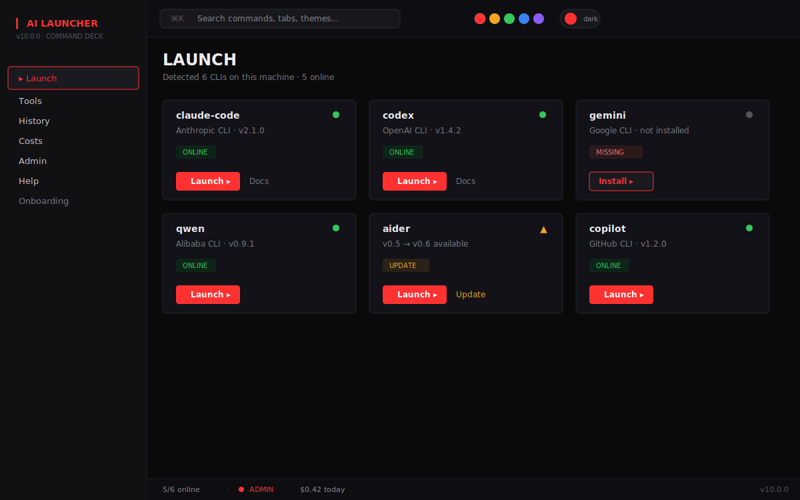
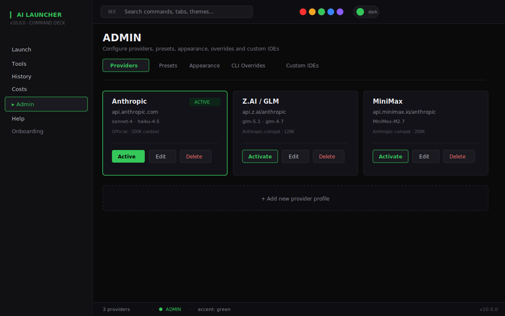
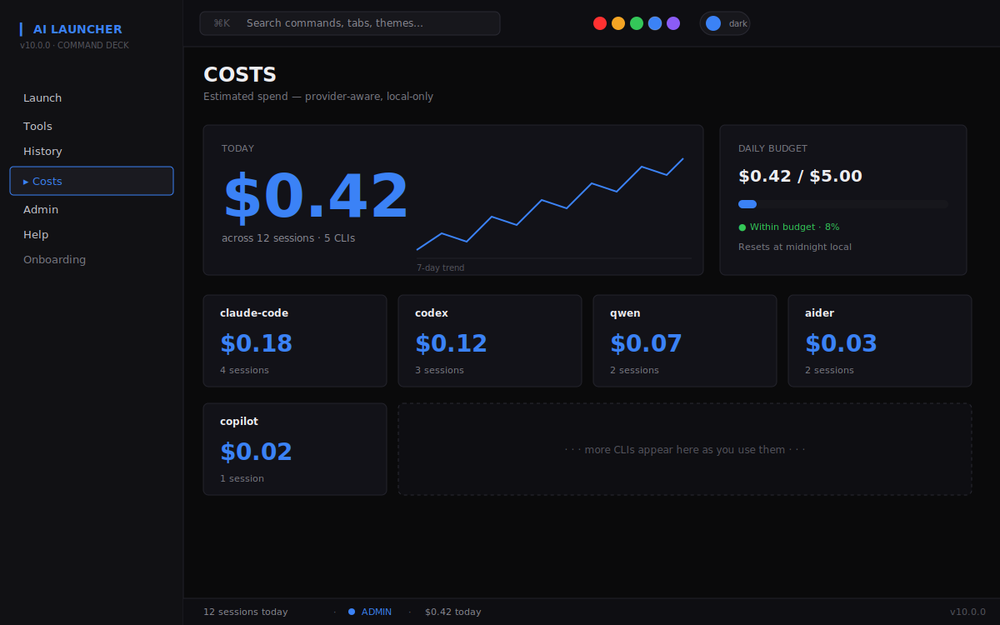

> 🇺🇸 English | [🇧🇷 Português (Brasil)](./README.pt-BR.md)

```text
   ┌─ AI LAUNCHER ─────────────────────────── v10.0.0 ──┐
   │                                                    │
   │   ▎ COMMAND DECK                                   │
   │                                                    │
   │   ● claude-code   online    v2.1.0                 │
   │   ● codex         online    v1.4.2                 │
   │   ○ gemini        missing                          │
   │   ● qwen          online    v0.9.1                 │
   │   ▲ aider         update    v0.5 → v0.6            │
   │   ● copilot       online    v1.2.0                 │
   │                                                    │
   │   5/8 online         ● ADMIN         $0.42 today   │
   └────────────────────────────────────────────────────┘
```

Desktop launcher for AI coding CLIs — detect, install, launch, track.


## What is it

AI Launcher is a Tauri v2 desktop app that manages AI coding CLIs — Claude Code, Codex, Gemini, Qwen, Aider, Copilot and more — alongside IDEs like VSCode, Cursor, Windsurf and JetBrains AI. It detects what's installed on your machine, helps you install what's missing, launches tools with the right provider context and working directory, and tracks spend per provider so you know exactly how much each session costs.

## Screenshots


_Launcher tab — scan results with status, versions, launch actions._


_Admin tab — providers, presets, appearance and CLI overrides._


_Costs tab — today's total, per-CLI tiles, spend trend._

## Install

### Download the `.msi`

Grab the latest installer from the [latest release](https://github.com/HelbertMoura/ai_launcher/releases).

Windows SmartScreen may warn on unsigned builds — use **More info → Run anyway**.

### Build from source

**Prerequisites:** Node 20+, Rust stable, Visual Studio Build Tools with **Desktop development with C++**.

```bash
git clone https://github.com/HelbertMoura/ai_launcher.git
cd ai_launcher
npm install
npm run tauri build
```

The `.msi` lands under `src-tauri/target/release/bundle/msi/`.

## Usage

### Keyboard shortcuts

- `Ctrl+K` / `⌘K` — open the command palette
- `Ctrl+1`..`Ctrl+4` — jump to the first four tabs
- `?` — open the help overlay
- `Esc` — close any open dialog

### Sidebar

The left rail exposes seven surfaces: **Launch** (scan and run CLIs), **Tools** (IDE management), **History** (past launches), **Costs** (per-provider spend), **Admin** (providers, presets, appearance, overrides, custom IDEs), **Help**, and **Onboarding**.

### Admin note

The launcher always runs with full system access (`--dangerously-skip-permissions` is the default). All credentials, overrides, and history stay local — nothing is transmitted except the API calls you explicitly trigger.

## Customize

- **Theme** — dark (default) or Hard Light
- **Accent** — 5 LED colors: red, amber, green, blue, violet
- **Font** — 5 monospace options including JetBrains Mono and Inter-paired fallbacks
- **CLI name/icon overrides** — rename any built-in CLI and upload a custom icon
- **Custom IDEs** — add any IDE not shipped by default, CRUD in Admin
- **Providers** — Anthropic, Z.AI, MiniMax, Moonshot, Qwen, OpenRouter and custom endpoints
- **Presets** — save CLI + provider + directory + args combos and fire them with `Ctrl+1..9`

## What's new in v10

- Full frontend rewrite in the **Command Deck** visual direction — dark-first monospace terminal aesthetic with LED accent
- New layered architecture under `src/app/`, `src/ui/`, `src/features/`, `src/theme/`, `src/icons/`, `src/hooks/`
- Attribute-based theme system (dark + Hard Light) with pre-paint restore so there's no flash of unstyled content
- 5-color accent system swappable from the top bar or command palette
- Tools tab is back — IDE management is once again a first-class surface
- Unified admin — no more toggle, one build with full access everywhere
- 16 custom line-art icons using `currentColor` and stroke-width 1.5 for crisp theming
- Command palette (`⌘K` / `Ctrl+K`) with Navigate, Theme and Accent groups
- Self-hosted JetBrains Mono + Inter — no external font requests

## Contributing

Fork the repo, create a feature branch, open a pull request against `main`. See [CONTRIBUTING.md](./CONTRIBUTING.md) for setup, conventions and the PR checklist.

## License

MIT — see [LICENSE](./LICENSE).

## Credits

- Author: **Helbert Moura** — DevManiac's
- **JetBrains Mono** — by JetBrains, licensed under SIL OFL 1.1
- **Inter** — by Rasmus Andersson, licensed under SIL OFL 1.1
- Icons are custom-drawn line-art glyphs — they are **not** official vendor logos. Brand names and trademarks belong to their respective owners.
