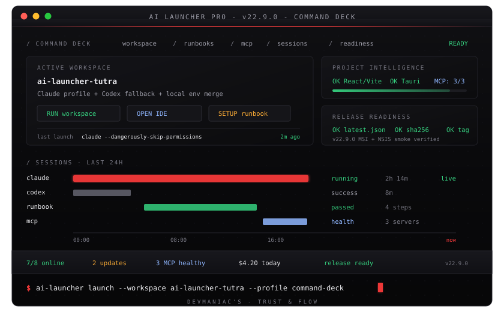
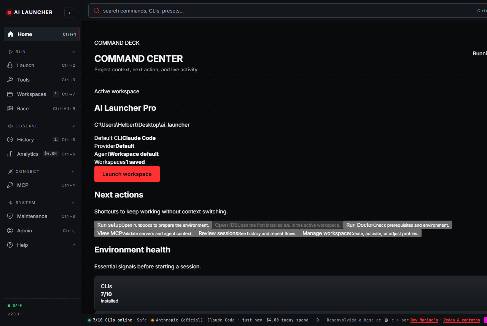
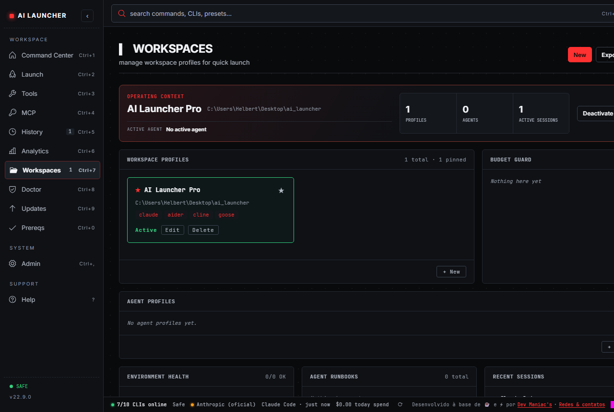
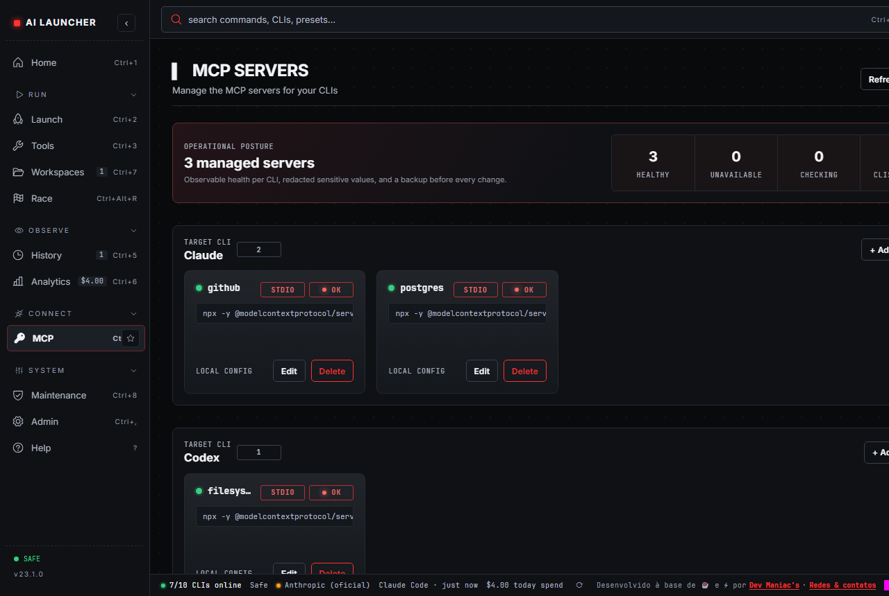
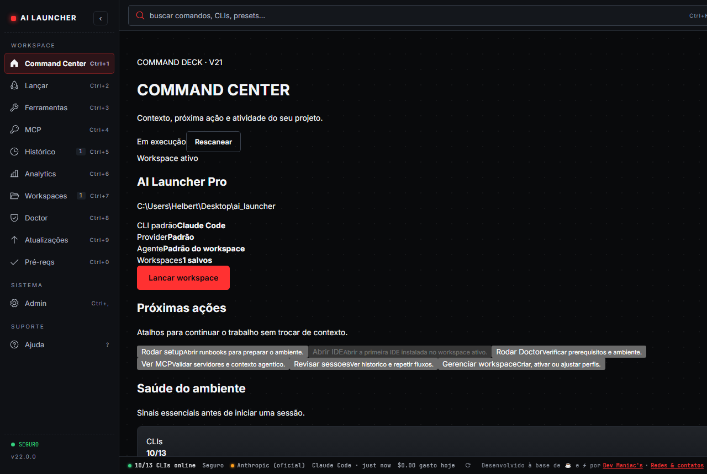
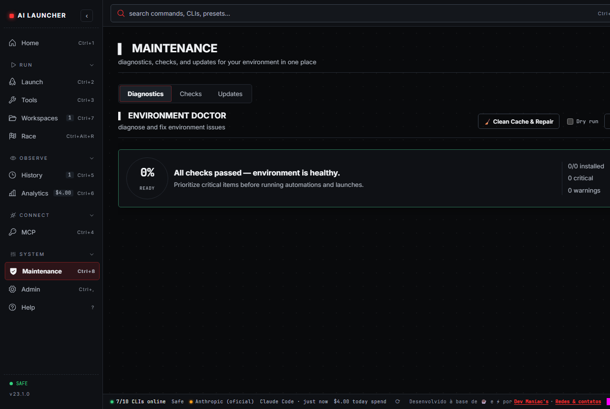

> 🇺🇸 English | [🇧🇷 Português (Brasil)](./README.pt-BR.md)

<div align="center">



<!-- demo gif: recorded by the Demo GIF workflow (scripts/record-demo.mjs) -->


# AI Launcher
### The Open-Source Command Deck for AI Coding Agents & MCPs

**A native, ultra-lightweight desktop control plane to discover, launch, orchestrate, and monitor all your AI CLI agents, custom IDEs, MCP servers, and multi-provider token budgets.**

[](./LICENSE)
[](https://github.com/HelbertMoura/ai_launcher/releases)
[](https://github.com/HelbertMoura/ai_launcher/releases)
[](https://github.com/HelbertMoura/ai_launcher/actions/workflows/quality.yml)


[📥 Download Installer](https://github.com/HelbertMoura/ai_launcher/releases/latest) · [💡 Why AI Launcher?](#-why-ai-launcher) · [📸 Visual Tour](#-visual-tour) · [🌟 Core Pillars](#-core-system-pillars) · [⚡ Quick Start](#-quick-start) · [🗺️ Roadmap](./ROADMAP.md) · [🤝 Code of Conduct](./CODE_OF_CONDUCT.md)

</div>

---

## 💡 Why AI Launcher?

Developing with AI today is fragmented: 10 different CLIs, conflicting API keys, scattered `.mcp.json` configs, unpredictable token spending across multiple providers, and heavy Electron apps that consume gigabytes of RAM.

**AI Launcher brings peace, speed, and focus back to your workflow:**

- 🚀 **One Unified Hub:** Launch Claude Code, Antigravity, Codex, Aider, Goose, Cline, Roo Code, Qwen, Kilo Code, OpenCode, Crush, Factory Droid, Continue, Cody, Copilot, VS Code, Cursor, and Windsurf in 1 click.
- 🧩 **Project-Aware MCP Hub:** Automatically detects your project stack and provisions validated Model Context Protocol servers per repository.
- 💰 **Budget Guard & Cost Analytics:** Real-time token spend tracking with configurable alerts before unexpected monthly invoices.
- ⚡ **Local-First & Blazing Fast:** Built with **Tauri v2 + Rust**, cold booting in <300ms, using less than 40MB RAM, with zero telemetry and 100% local encrypted storage.

---

## 🌟 Core System Pillars

### 1. 🚀 Multi-Agent & Workspace Command Center
- **Instant Multi-Agent Launcher:** Detects installed CLIs and IDEs, surfacing one-click launch, upgrade, and execution buttons.
- **Workspace Profiles:** Group directories, environment variables, model presets, and pinned projects for effortless context switching.
- **Agent Runbooks:** Define declarative, repeatable multi-step setup scripts with live log streaming and interactive safety checks.

### 2. 🧠 Project Intelligence & System Doctor
- **Automatic Stack Detection:** Scans manifest signals (`package.json`, `Cargo.toml`, `pyproject.toml`, `go.mod`, `Dockerfile`) without reading sensitive files.
- **MCP Server Management:** Relates required MCP tools to active projects, monitors connection health, and installs pre-tested tool configs.
- **Environment Doctor:** Concurrent Tokio diagnostics (`check_environment`) verify 15 runtimes and offer guided one-click repairs.

### 3. 💰 Cost Tracking, Governance & Privacy
- **Cost Analytics 2.0:** Multi-provider spend tracking (Anthropic, OpenRouter, MiniMax, Qwen, Moonshot) with dynamic 7d, 14d, 30d, 90d rollups.
- **Budget Guard:** Set monthly dollar thresholds per provider and receive proactive notification alerts.
- **Privacy & Security Vault:** Zero telemetry, no cloud accounts. All API keys are encrypted in the native OS vault — Windows Credential Manager, macOS Keychain, or Linux Secret Service — failing closed when no vault is available.

### 4. ⚡ Developer Ergonomics & Customization
- **Keyboard-First:** `Ctrl+K` command palette, `Ctrl+1-9/0` tab switcher, `Ctrl+,` preferences, and `?` quick help.
- **7 Themes:** Dark, Light, Amber, Glacier, Phosphor, Midnight, and a dedicated High Contrast, with adjustable layout density (Compact / Comfortable).
- **Cryptographic OTA Updates:** Built-in self-updater verified with Minisign signatures for safe, background updates.

---

## 📸 Visual Tour

<div align="center">

<p><strong>A cohesive, developer-first command deck engineered for speed, confidence, and focus.</strong></p>

<table>
  <tr>
    <td width="50%" align="center">
      <h3>🧭 Command Center & Workspace Readiness</h3>
      <a href="./docs/screenshots/v22/01-command-center.png"></a>
      <p><em>Instant readiness score, project intelligence signals, quick actions and active sessions.</em></p>
    </td>
    <td width="50%" align="center">
      <h3>🚀 Multi-Agent Hub & Launcher</h3>
      <a href="./docs/screenshots/v22/07-launcher-multi-agent.png"></a>
      <p><em>One-click detect, install, and execute Claude Code, Antigravity, Codex, Aider, Goose and more.</em></p>
    </td>
  </tr>
  <tr>
    <td width="50%" align="center">
      <h3>🧩 Runbooks & Automated Pipelines</h3>
      <a href="./docs/screenshots/v22/02-runbooks-command-deck.png"></a>
      <p><em>Automated, reproducible environment setups with step approval and live streaming logs.</em></p>
    </td>
    <td width="50%" align="center">
      <h3>🔗 Project MCP Hub</h3>
      <a href="./docs/screenshots/v22/03-mcp-hub.png"></a>
      <p><em>Automatic repository MCP detection, health status monitoring, and validated server presets.</em></p>
    </td>
  </tr>
  <tr>
    <td width="50%" align="center">
      <h3>💰 Cost Analytics 2.0 & Budget Guard</h3>
      <a href="./docs/screenshots/v22/08-costs-analytics.png"></a>
      <p><em>Real-time spend charts by provider with dynamic 7d/14d/30d/90d ranges and threshold alerts.</em></p>
    </td>
    <td width="50%" align="center">
      <h3>📋 History Timeline & Waterfall Logs</h3>
      <a href="./docs/screenshots/v22/04-history-timeline.png"></a>
      <p><em>Terminal-style waterfall history with duration tracking, status dots, and one-click relaunch.</em></p>
    </td>
  </tr>
  <tr>
    <td width="50%" align="center">
      <h3>🩺 Environment Doctor & Diagnostics</h3>
      <a href="./docs/screenshots/v22/05-doctor-readiness.png"></a>
      <p><em>Proactive runtime checks (Node, Python, Rust, Docker) and guided one-click automated fixes.</em></p>
    </td>
    <td width="50%" align="center">
      <h3>🎨 Help, Brand & Multi-Theme Customization</h3>
      <a href="./docs/screenshots/v22/06-help-support.png"></a>
      <p><em>Built-in support, keyboard shortcut references, and official Dev Maniac's ecosystem links.</em></p>
    </td>
  </tr>
</table>

</div>

---

## ⚡ Quick Start

### Install (Windows)

Download the installer from the [latest GitHub release](https://github.com/HelbertMoura/ai_launcher/releases/latest):

- `.exe` (NSIS) — recommended for most users.
- `.msi` — useful for managed or administrative deployments.

> SmartScreen may warn on unsigned builds -- click **More info, then Run anyway**.

Or install via **Scoop**:

```powershell
scoop bucket add ai-launcher https://github.com/HelbertMoura/ai_launcher
scoop install ai-launcher/ai-launcher
```

### Install (macOS)

Download the `.dmg` for your Mac from the [latest GitHub release](https://github.com/HelbertMoura/ai_launcher/releases/latest):

- `*-aarch64.dmg` — Apple Silicon (M1/M2/M3/M4).
- `*_x64.dmg` — Intel Macs.

Open the `.dmg` and drag **AI Launcher** into **Applications**. The app is not notarized yet, so Gatekeeper warns on the first launch: right-click the app in Applications and choose **Open**, then confirm — from the second launch on it opens normally.

### Install (Linux)

From the [latest GitHub release](https://github.com/HelbertMoura/ai_launcher/releases/latest):

- **AppImage** — make it executable and run it:

  ```bash
  chmod +x AI.Launcher_<version>_amd64.AppImage
  ./AI.Launcher_<version>_amd64.AppImage
  ```

- **Debian / Ubuntu (.deb)**:

  ```bash
  sudo apt install ./AI.Launcher_<version>_amd64.deb
  ```

> **Package managers:** **Scoop is live** via the repository's own bucket (see the Windows section above) and updates automatically on each new release.

### Build from Source

**Prerequisites:** Node.js 20.19+ or 22.12+, Rust stable, and Visual Studio Build Tools with **Desktop development with C++**.

```bash
git clone https://github.com/HelbertMoura/ai_launcher.git
cd ai_launcher
npm ci
npm run tauri build
```

The installers are generated in:

- MSI: `src-tauri/target/release/bundle/msi/`
- EXE (NSIS): `src-tauri/target/release/bundle/nsis/`

---

## ⌨️ Keyboard Shortcuts

| Shortcut | Action |
|----------|--------|
| `Ctrl+K` | Open rich command palette |
| `Ctrl+1` | Command Center |
| `Ctrl+2` | Launch tab |
| `Ctrl+3` | Tools tab |
| `Ctrl+4` | MCP tab |
| `Ctrl+5` | History tab (sessions dashboard) |
| `Ctrl+6` | Analytics tab |
| `Ctrl+7` | Workspaces tab |
| `Ctrl+8` | Doctor tab (environment diagnosis) |
| `Ctrl+9` | Updates tab |
| `Ctrl+0` | Prerequisites tab |
| `Ctrl+,` | Admin tab |
| `?` | Help tab |
| `Esc` | Close dialog |

---

## 🧭 Surfaces & Navigation

The app features 12 specialized surfaces accessible from the sidebar and command palette:

| Tab | What it does |
|-----|-------------|
| **Command Center** | Central command deck with workspace readiness, quick actions, active sessions, and project stack signals |
| **Launch** | Scan for AI CLIs, install missing engines, launch with custom directories, model presets, and execution arguments |
| **Tools** | Detect and manage IDEs — launch or install VS Code, Cursor, Windsurf, JetBrains AI with one click |
| **MCP** | Manage Model Context Protocol configs for Claude/Codex/Gemini with catalog presets, health checks, and backups |
| **History** | Waterfall session timeline with filters, duration tracking, process kill, and one-click session replay |
| **Analytics** | Per-provider spend breakdown — today, weekly, and monthly totals with dynamic token velocity charts |
| **Workspaces** | Workspace Profiles, Agent Profiles, Budget Guard, Doctor summary, Runbooks, and Recent Sessions |
| **Doctor** | In-depth environment diagnostics with severity levels (critical/warning/info) and guided automated fixes |
| **Updates** | Centralized hub for CLI, tool, and prerequisite updates with real-time download and upgrade progress |
| **Prereqs** | High-speed concurrent verification for Node, npm, Bun, Python, Rust, Cargo, Git, Docker, and PowerShell |
| **Admin** | Model Providers (with API test latency), profiles, appearance, CLI overrides, and custom executable IDEs |
| **Help** | Keyboard shortcuts reference, FAQs, animated terminal demo, and welcome onboarding tour |

---

## 🚀 What's new in v22 — Multi-Agent Ecosystem & Modular Core

- **Modular Rust Backend** — Refactored monolithic core into modular sub-crates (`definitions`, `process`, `terminal`, `versions`, `tray_cfg`) for optimal maintainability and speed.
- **Extended Multi-Agent Ecosystem** — First-class support and native icons for Aider, Goose, Cline and Roo Code alongside existing engines.
- **Cost & Budget Intelligence 2.0** — Dynamic time-range filters (7d, 14d, 30d, 90d), live token velocity run-rate calculations, and refined chart telemetry.
- **Brand & Official Identity** — Integrated Dev Maniac's official footer and contact surfaces across the entire application with native external browser handlers.
- **Component Decomposition** — Decoupled massive views into clean, accessible sub-components (`ProjectIntelligence`, `ReadinessCard`).

Read the [v22 release notes](./docs/releases/v22.0.0.md).

<details><summary>v21 highlights</summary>

- **Trust Foundation** — provider secrets fail closed into Windows Credential Manager, with safer legacy migration and storage guardrails.
- **Command Deck visual system** — clearer app shell, typography, density/accent controls, light/dark/high-contrast baselines and keyboard-first layouts.
- **Command Center 2.0** — guided empty states, project readiness, `.ailauncher.json` review, active sessions and safer primary actions.
- **Runbooks 3.0** — dry-run, approvals, retry/resume, real stop, bounded output and workspace activity timeline.
- **Operational pages refreshed** — Launcher, Workspaces, History, MCP, Updates, Admin, Analytics, Doctor, Prereqs, Onboarding and Help.
- **Release readiness** — critical workflow E2E, visual regression matrix, capability/storage audits and packaged Windows smoke harness.

</details>

<details><summary>v20 highlights</summary>

- **Command Center** — default home with active workspace, launch, readiness cards, sessions and project intelligence
- **Project Intelligence** — stack detector for Node/React/Vite/Tauri/Rust/Python/Go/Docker/MCP plus `.ailauncher.json` creation
- **Runbooks 2.0** — local presets, conditional steps and persisted execution timelines
- **Project MCP** — match required MCP servers from project profile and show healthy/missing state
- **Agent Profiles** — reusable agent launch presets with CLI, args and provider
- **Sessions 2.0** — dashboard metrics, persisted filters, replay through the shared launch flow and confirmed kill
- **Backup Trust** — export manifest, recursive secret redaction and import preview before local restore
- **Updater Trust** — visible release trust chain plus `latest.json` validation in release audit

</details>

<details><summary>v16 highlights</summary>

- **Agent Analytics** — 30-day cost series, top projects, model breakdowns and CSV/JSON export
- **Inbox Center** — local update, budget, doctor and session notifications with read state
- **Accessibility AA pass** — contrast fixes, structured axe coverage and safer focus behavior
- **MCP Manager** — manage Claude, Codex and Gemini MCP configs with backups and health checks
- **Theme Foundry** — Phosphor, Midnight and High Contrast themes plus token contract tests
- **Project Profiles** — `.ailauncher.json` can prefill CLI, provider, directory and env per repo
- **Workspace Profiles** — group configs by repo, team or context with one-click switching

</details>

### 🐛 Critical fix (affected v13/v14)

The **Install** button in Prereqs, **Fix** button in Doctor, and **Install prereq** in Updates **did nothing on click** in prior versions. Fixed by adding a canonical `key` field to `CheckResult` and a real install button in `PrereqCard`.

<details><summary>v14 highlights</summary>

- **Autostart + global hotkey** -- launch with Windows, focus from anywhere
- **Pinned dirs + session templates** -- one-click relaunch for your favorite setups
- **History filters, usage export, desktop notifications** -- full observability
- **Free-form accent color picker** -- any hex, not just 5 presets
- **Backend modularized** -- `main.rs` from 3105 to ~120 lines, typed errors, unit tests
- **CI quality gates** -- tsc, vitest, clippy, cargo audit, Playwright E2E on every PR

</details>

<details><summary>v13 highlights</summary>

- **New minimalist icon** — Hex Hub design in red, clean and recognizable at any size
- **Provider persistence in history** — Reopening a Claude session now restores the exact provider used
- **Recent directories dropdown** — Last 10 directories per CLI shown on focus for quick selection
- **Screenshots in docs** — Full gallery of all app surfaces in the README

</details>

<details><summary>v12.5 highlights</summary>

- Updates tab — Dedicated surface for CLI, tool and prerequisite updates
- Install from cards — Install missing CLIs and tools directly from tabs
- History improvements — Reopen sessions, descriptions, status badges, duration tracking
- Test API button — Test provider connections from Admin with latency display
- Official brand icons — Real vendor logos from LobeHub Icons and devicons
- Welcome screen — DevManiacs branding, guided tour, "always show" option

</details>

---

## 🛠️ Tech Stack

| Layer | Technology |
|---|---|
| **Frontend** | React 19 + TypeScript 7 + Vite |
| **Backend** | Rust (Tauri v2) with the native OS keyring (Windows Credential Manager / macOS Keychain / Linux Secret Service) |
| **Styling** | CSS Custom Properties (token system · 7 themes: dark, light, amber, glacier, phosphor, midnight, high-contrast) |
| **Typography** | JetBrains Mono · Inter · Space Grotesk (display) |
| **Icons** | Official brand logos (LobeHub Icons, devicons) + Phosphor Icons |
| **i18n** | i18next 26 (English & Portuguese - Brazil) |
| **Testing** | Vitest (239 tests), Playwright E2E / visual, cargo test (127 Rust tests) |
| **Build** | Tauri CLI → `.msi` + `.exe` (NSIS) · `.dmg` (Apple Silicon + Intel) · AppImage + `.deb` |
| **Distribution** | GitHub Releases · Scoop (auto-update on Windows) |

---

## 🤝 Contributing

Fork the repository, create a feature branch, and open a PR against `main`. See [CONTRIBUTING.md](./CONTRIBUTING.md) for setup instructions, conventions, and the PR checklist.

---

## 📄 License

MIT License — see [LICENSE](./LICENSE).

---

## ☕ Credits & Support
 
- **Developed with ☕ and ⚡ by:** [Dev Maniac's](https://devmaniacs.com.br/) · [Links & Contacts](https://linktr.ee/helbertmoura)
- **Author:** Helbert Moura — [Dev Maniac's](https://devmaniacs.com.br/)
- **Icons:** [LobeHub Icons](https://github.com/lobehub/lobe-icons), [devicons](https://github.com/devicons/devicon), [Phosphor Icons](https://phosphoricons.com/)
- Brand names and trademarks belong to their respective owners.

---

<div align="center">

Developed with ☕ and ⚡ by **[Dev Maniac's](https://devmaniacs.com.br/)** · **[Links & Contacts](https://linktr.ee/helbertmoura)**

**[Download](https://github.com/HelbertMoura/ai_launcher/releases)** · **[Report Bug](https://github.com/HelbertMoura/ai_launcher/issues)** · **[Request Feature](https://github.com/HelbertMoura/ai_launcher/issues)**

</div>
