> [🇺🇸 English](./README.md) | 🇧🇷 Português (Brasil)

<div align="center">

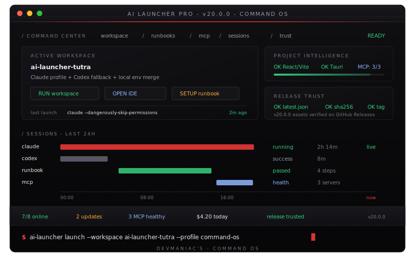

**Um app desktop para detectar, instalar, executar, atualizar e monitorar todas as suas ferramentas de IA.**

[](./LICENSE)
[](https://github.com/HelbertMoura/ai_launcher/releases)
[](https://github.com/HelbertMoura/ai_launcher/releases)


</div>

---

## Funcionalidades

| | Funcionalidade | Descrição |
|---|---------------|-----------|
| 🚀 | **Launcher de CLIs** | Detecte, instale e execute Claude Code, Codex, Gemini CLI, Qwen, Crush, Droid, Kilocode, OpenCode e mais |
| 🔧 | **Gerenciador de Tools** | Gerencie VS Code, Cursor, Windsurf, Google Antigravity, JetBrains AI e IDEs customizadas |
| ⬆️ | **Hub de Atualizações** | Aba dedicada para updates de CLIs, ferramentas e pré-requisitos com instalação em um clique |
| 💰 | **Rastreamento de Custos** | Acompanhe gastos por provider com breakdown diário e mensal |
| 📋 | **Histórico Avançado** | Log de sessões com reabertura, descrições, badges de status e duração |
| 🔍 | **Verificação de Pré-requisitos** | Cheque Node, npm, Bun, Python, Rust, Cargo, Git, Docker e mais |
| 🔌 | **Providers** | Anthropic, Z.AI, MiniMax, Moonshot, Qwen, OpenRouter + endpoints customizados com botão de teste de API |
| 🎨 | **Customização Completa** | Tema Dark/Light, 5 cores de destaque, 5 fontes mono, overrides de CLIs |
| 🌐 | **i18n** | Inglês e Português (Brasil) com alternância instantânea |
| ⌨️ | **Keyboard-First** | Paleta `Ctrl+K`, navegação `Ctrl+1-6`, admin `Ctrl+,`, ajuda `?` |
| 🔒 | **Privacidade Primeiro** | Tudo fica local — sem telemetria, sem sync na nuvem |

## Screenshots

<div align="center">

| Launcher CLIs | Ferramentas | Diálogo de Launch |
|:---:|:---:|:---:|
| 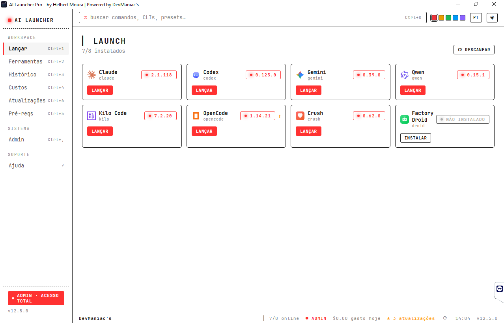 | 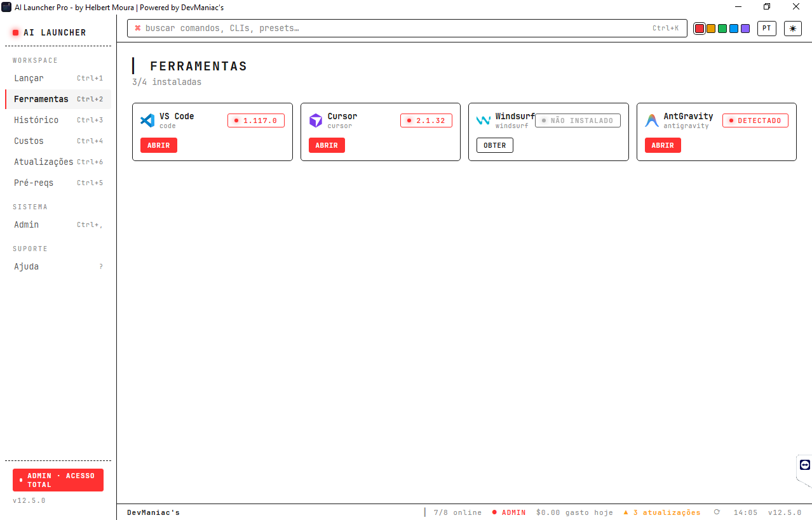 | 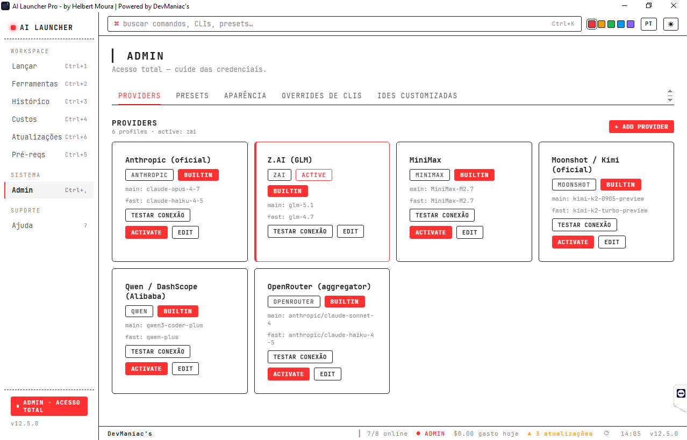 |

| Histórico | Providers | Configurações |
|:---:|:---:|:---:|
| 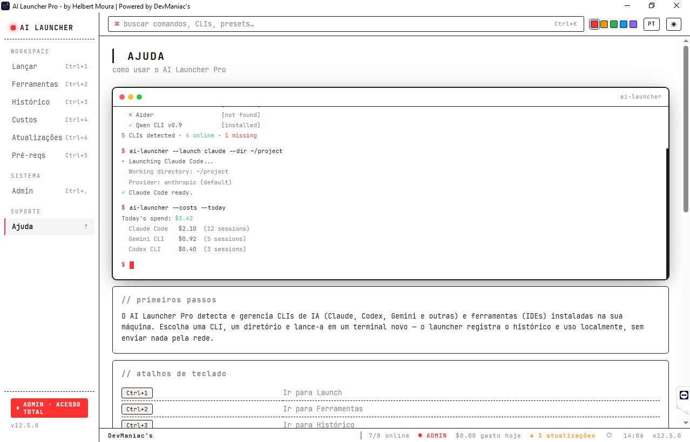 | 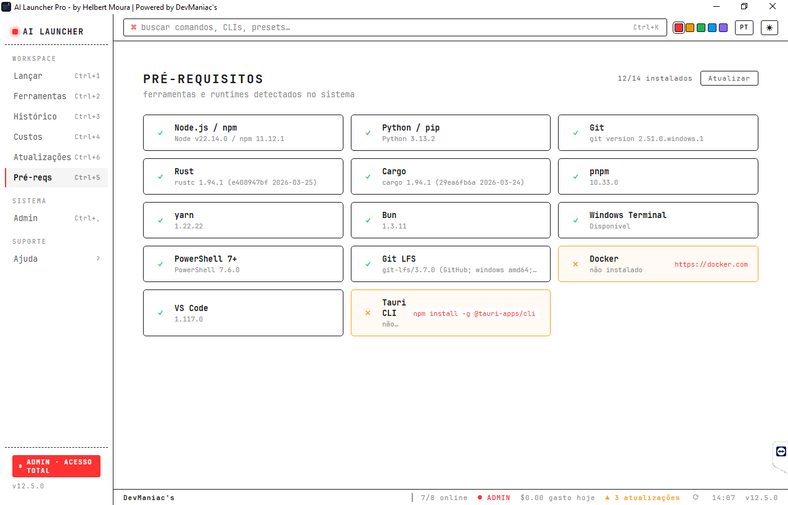 | 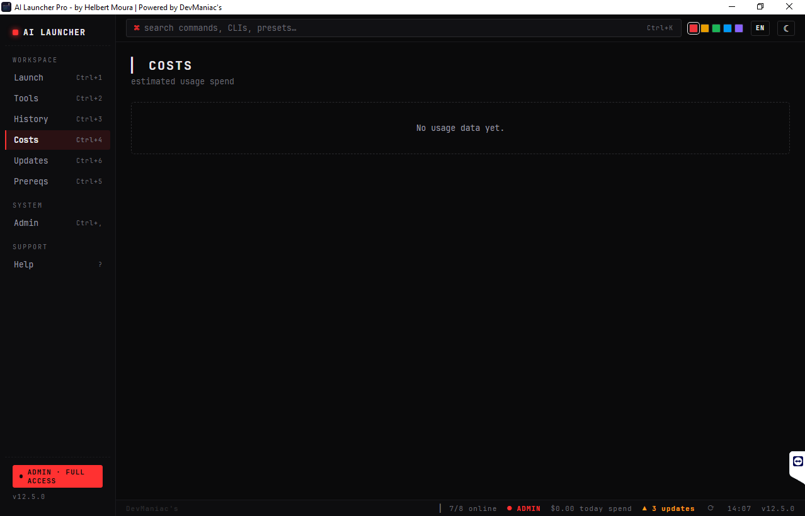 |

| Onboarding | Atualizações | Editar Provider |
|:---:|:---:|:---:|
| 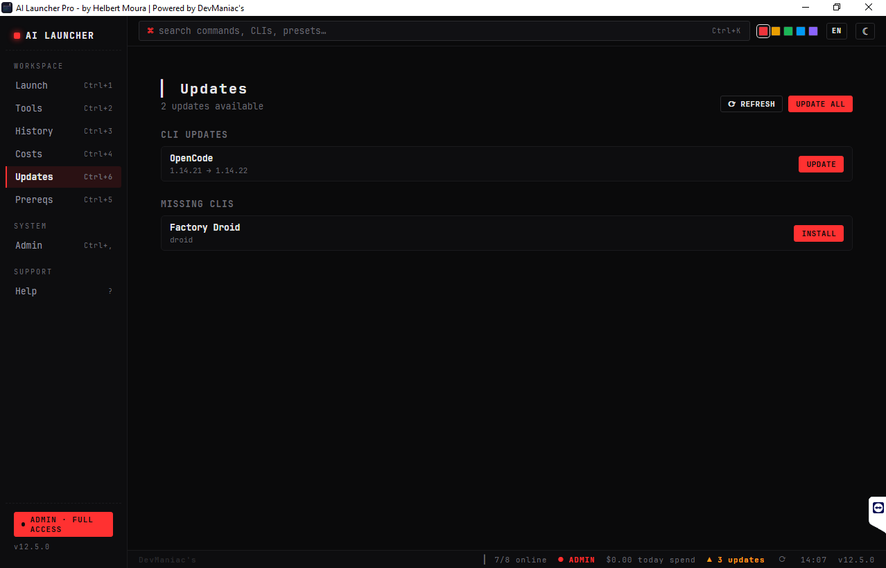 | 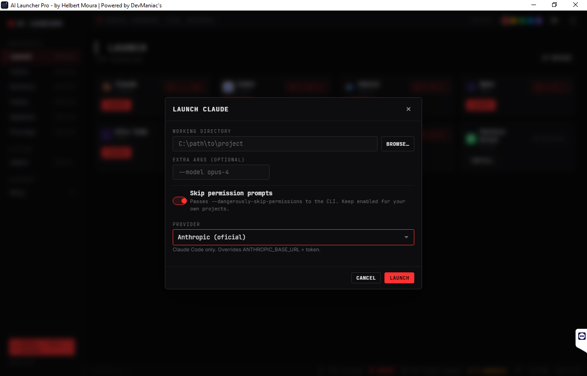 | 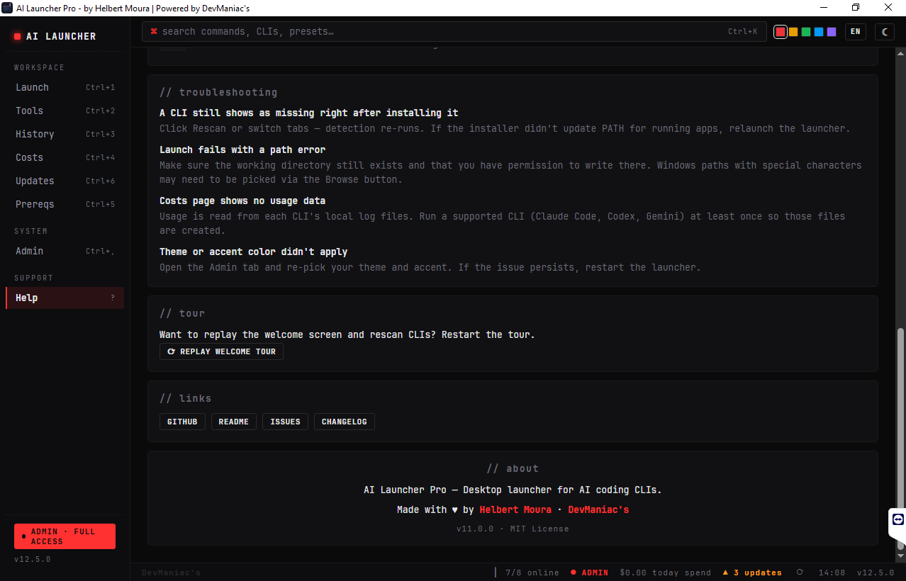 |

| Boas-vindas | Tema Escuro |
|:---:|:---:|
| 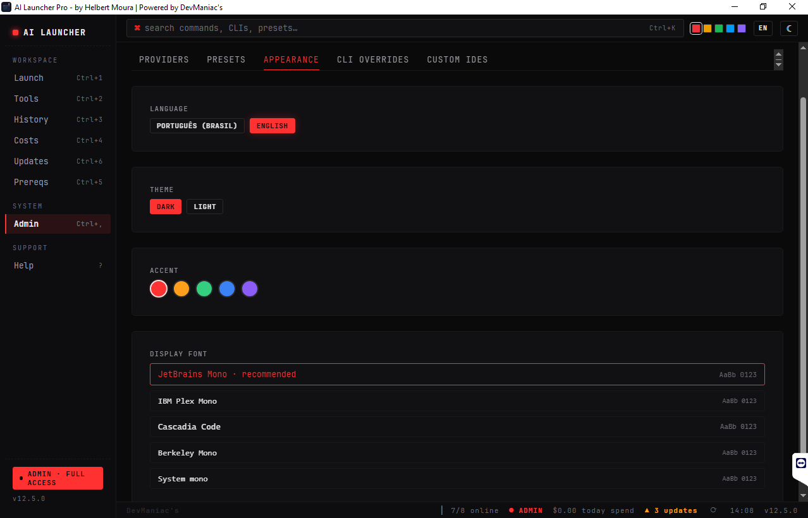 | 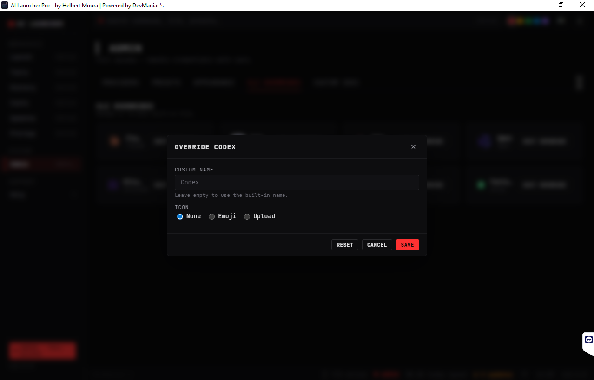 |

</div>

## Instalação Rápida

### Download (Windows)

Baixe o instalador `.msi` no [último release](https://github.com/HelbertMoura/ai_launcher/releases).

> O SmartScreen pode alertar em builds sem assinatura — clique em **Mais informações → Executar mesmo assim**.

### Build a Partir do Código

**Pré-requisitos:** Node 20+, Rust stable, Visual Studio Build Tools com **Desktop development with C++**.

```bash
git clone https://github.com/HelbertMoura/ai_launcher.git
cd ai_launcher
npm install
npm run tauri build
```

O `.msi` é gerado em `src-tauri/target/release/bundle/msi/`.

## Atalhos de Teclado

| Atalho | Ação |
|--------|------|
| `Ctrl+K` | Abrir paleta de comandos |
| `Ctrl+1` | Aba Launch |
| `Ctrl+2` | Aba Ferramentas |
| `Ctrl+3` | Aba Histórico |
| `Ctrl+4` | Aba Custos |
| `Ctrl+5` | Aba Atualizações |
| `Ctrl+6` | Aba Pré-requisitos |
| `Ctrl+,` | Aba Admin |
| `?` | Aba Ajuda |
| `Esc` | Fechar diálogo |

## Superfícies

O app tem 8 superfícies principais acessíveis pela sidebar:

| Aba | O que faz |
|-----|-----------|
| **Launch** | Escaneie CLIs de IA, instale as faltantes, lance com diretório e args customizados |
| **Ferramentas** | Detecte e gerencie IDEs — instale ferramentas faltantes com um clique |
| **Histórico** | Navegue sessões passadas com reabertura, descrições inline, badges de status e duração |
| **Custos** | Breakdown de custo por CLI — totais diários e mensais com tracking de tokens |
| **Atualizações** | Hub centralizado para updates de CLIs, ferramentas e pré-requisitos — atualize tudo ou individualmente |
| **Pré-reqs** | Health check do sistema — Node, npm, Bun, Python, Rust, Git, Docker, Terminal |
| **Admin** | Providers (com teste de API), presets, aparência, overrides de CLIs, IDEs customizadas |
| **Ajuda** | Atalhos, FAQ, terminal animado demo, replay do tour de boas-vindas |

## 🚀 Novidades da v14

- **Início com Windows + atalho global** — abre junto com o sistema, foca de qualquer lugar
- **Diretórios fixados + templates de sessão** — um clique para relançar seus setups favoritos
- **Filtros no histórico, export de custos, notificações** — observabilidade completa
- **Cor de destaque livre** — qualquer hex, não só os 5 presets
- **Backend modularizado** — `main.rs` de 3105 → ~120 linhas, erros tipados, testes unitários
- **CI com quality gates** — tsc, vitest, clippy, cargo audit, Playwright E2E em cada PR

<details><summary>Destaques da v13</summary>

- **Novo ícone minimalista** — Design Hex Hub em vermelho, limpo e reconhecível em qualquer tamanho
- **Provider persiste no histórico** — Ao reabrir uma sessão do Claude, restaura o provider exato usado
- **Dropdown de diretórios recentes** — Últimos 10 diretórios por CLI ao focar no campo, seleção rápida
- **Screenshots na documentação** — Galeria completa de todas as telas do app no README

</details>

<details><summary>Destaques da v12.5</summary>

- Aba Atualizações — Superfície dedicada para updates de CLIs, ferramentas e pré-requisitos
- Instalar pelos cards — Instale CLIs e ferramentas faltantes direto nas abas
- Histórico avançado — Reabra sessões, descrições, badges de status, tracking de duração
- Botão Testar API — Teste conexões de providers com exibição de latência
- Ícones oficiais — Logos reais via LobeHub Icons e devicons
- Tela de boas-vindas — Branding DevManiacs, tour guiado

</details>

## Stack Técnica

| Camada | Tecnologia |
|--------|-----------|
| Frontend | React 19 + TypeScript 6 + Vite |
| Backend | Rust (Tauri v2) |
| Estilo | CSS Custom Properties (sistema de tokens) |
| i18n | i18next 24 |
| Ícones | Logos oficiais de marca (LobeHub Icons, devicons) |
| Build | Tauri CLI → `.msi` + `.exe` |

## Contribuindo

Faça fork do repositório, crie uma branch de feature e abra um PR contra `main`. Veja [CONTRIBUTING.md](./CONTRIBUTING.md) para setup, convenções e checklist de PR.

## Licença

MIT — veja [LICENSE](./LICENSE).

## Créditos

- **Autor:** Helbert Moura — [DevManiac's](https://github.com/HelbertMoura)
- **Ícones** — [LobeHub Icons](https://github.com/lobehub/lobe-icons), [devicons](https://github.com/devicons/devicon)
- Nomes de marcas e marcas registradas pertencem aos seus respectivos donos.

---

<div align="center">

**[Download](https://github.com/HelbertMoura/ai_launcher/releases)** · **[Reportar Bug](https://github.com/HelbertMoura/ai_launcher/issues)** · **[Sugerir Feature](https://github.com/HelbertMoura/ai_launcher/issues)**

</div>
