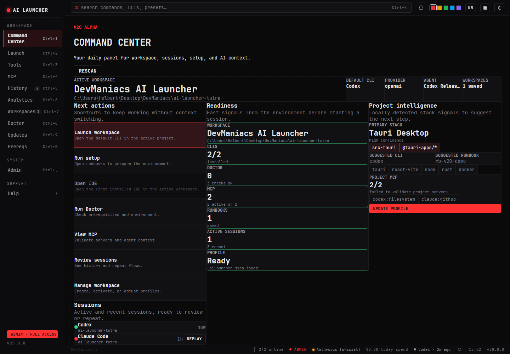
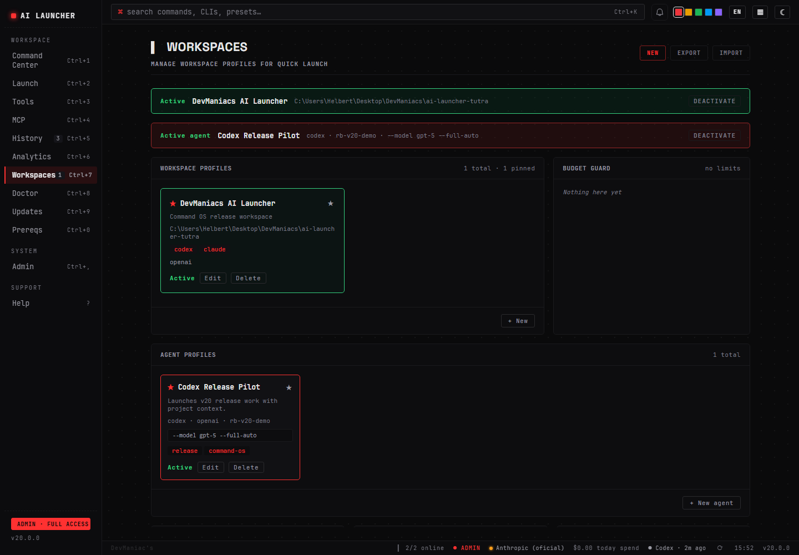
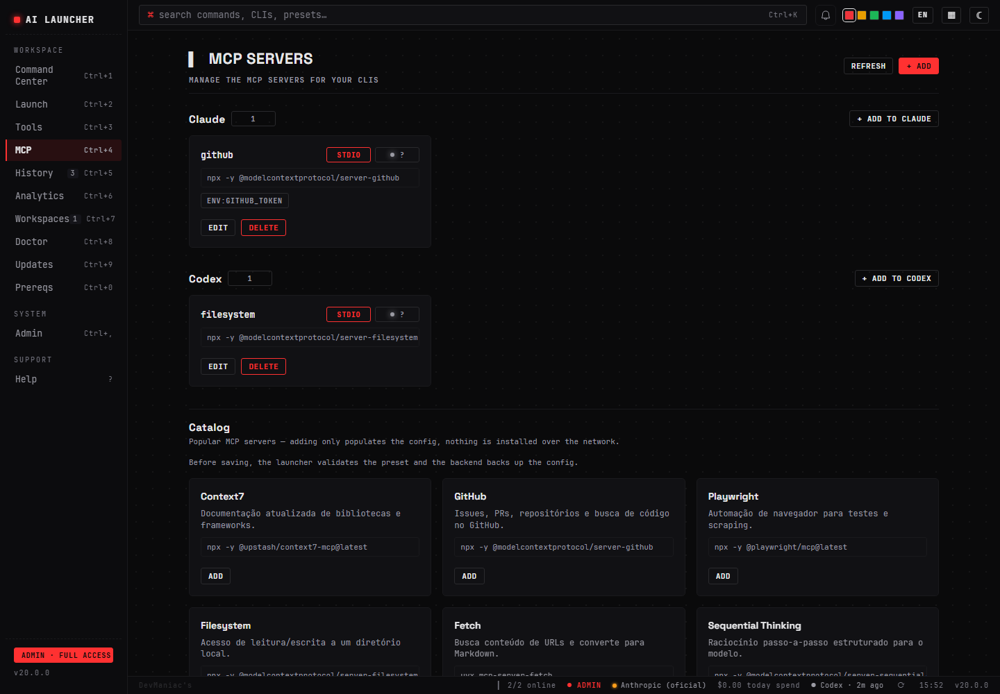
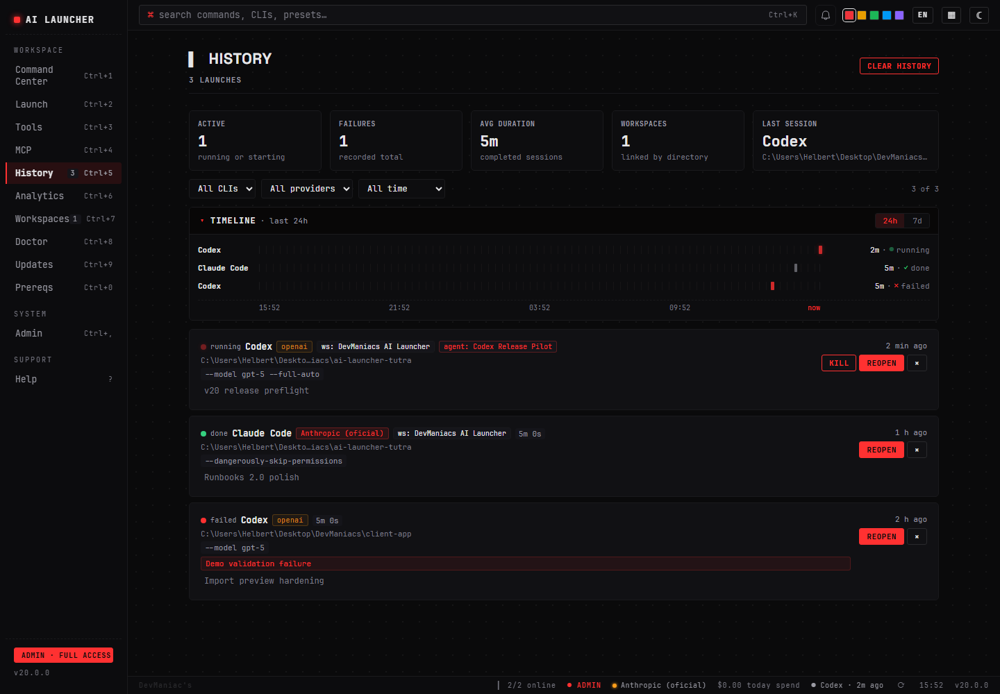
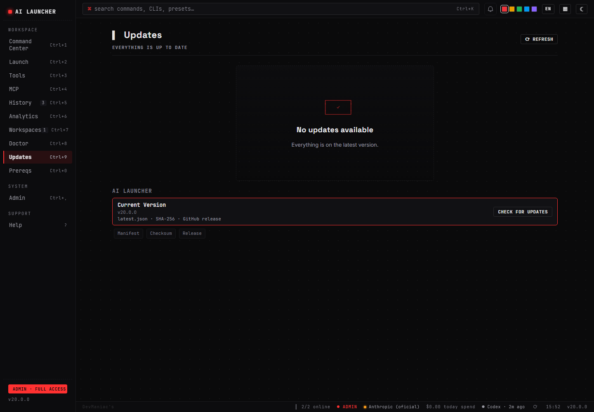

> [🇺🇸 English](./README.md) | 🇧🇷 Português (Brasil)

<div align="center">


**Um app desktop para detectar, instalar, executar, atualizar e monitorar todas as suas ferramentas de IA.**

[](./LICENSE)
[](https://github.com/HelbertMoura/ai_launcher/releases)
[](https://github.com/HelbertMoura/ai_launcher/releases)


</div>

---

## Funcionalidades

| | Funcionalidade | Descrição |
|---|---------------|-----------|
| 🚀 | **Launcher de CLIs** | Detecte, instale e execute Claude Code, Codex, Gemini CLI, Antigravity, Qwen, Crush, Droid, Kilocode, OpenCode e mais |
| 🔧 | **Gerenciador de Tools** | Gerencie VS Code, Cursor, Windsurf, JetBrains AI e IDEs customizadas |
| ⬆️ | **Hub de Atualizações** | Aba dedicada para updates de CLIs, ferramentas e pré-requisitos com instalação em um clique |
| 💰 | **Rastreamento de Custos** | Acompanhe gastos por provider com breakdown diário e mensal |
| 📋 | **Histórico Waterfall** | Timeline estilo terminal + log de sessões com reabertura, status dots e duração |
| 🔍 | **Verificação de Pré-requisitos** | Cheque Node, npm, Bun, Python, Rust, Cargo, Git, Docker e mais |
| 🔌 | **Providers** | Anthropic, Z.AI, MiniMax, Moonshot, Qwen, OpenRouter + endpoints customizados com botão de teste de API |
| 🎨 | **4 Temas + Densidade** | Dark / Light / Amber (CRT retro) / Glacier (frio azul) + toggle compacto/confortável |
| 🌐 | **i18n** | Inglês e Português (Brasil) com alternância instantânea |
| ⌨️ | **Keyboard-First** | Paleta rica `Ctrl+K`, navegação `Ctrl+1-9/0`, admin `Ctrl+,`, ajuda `?` |
| 🧭 | **Command Center** | Home com readiness do workspace, launch rápido, sessões, inteligência de projeto e setup |
| 🧠 | **Project Intelligence** | Detecta stack, sugere CLIs/runbooks e cria `.ailauncher.json` com segurança |
| 👥 | **Agent Profiles** | Salve presets de agente com CLI, args e provider para launches repetíveis |
| 🔗 | **MCP por Projeto** | Relaciona MCPs exigidos pelo projeto, mostra faltantes/saudáveis e aplica presets validados |
| 🔒 | **Privacidade Primeiro** | Tudo fica local — sem telemetria, sem sync na nuvem |
| 🏢 | **Workspace Profiles** | Agrupe configurações por repositório, time ou contexto com troca em um clique |
| 🧩 | **Agent Runbooks** | Sequências automatizadas de setup de ambiente para workflows de agentes IA |
| 🛡️ | **Budget Guard** | Limites locais de custo por provider com alertas em thresholds configuráveis |
| 🩺 | **Environment Doctor** | Diagnostique e repare ambientes de dev quebrados com fixes guiados |
| 👁️ | **Safe Command Preview** | Revise executável, args, env e nível de risco antes de rodar comandos customizados |
| 🔄 | **Auto-Atualização** | Verificação de updates in-app, download com progresso, validação por checksum |

## Screenshots

<div align="center">

### Command OS v20 · Command Center, Runbooks, MCP

| Command Center | Workspaces + Runbooks | Hub MCP |
|:---:|:---:|:---:|
|  |  |  |

### Sessions 2.0 · Updater Trust

| Dashboard de Sessões | Updater Trust |
|:---:|:---:|
|  |  |

</div>

## Instalação Rápida

### Download (Windows)

Baixe o instalador `.msi` ou `.exe` no [último release](https://github.com/HelbertMoura/ai_launcher/releases).

```bash
# Opção 1: Download manual (disponível agora)
# Pegue o .msi ou .exe do último release em:
# https://github.com/HelbertMoura/ai_launcher/releases

# Opção 2: Winget — 🚧 Em breve (ainda não publicado)
winget install DevManiacs.AILauncher

# Opção 3: Chocolatey — 🚧 Em breve (ainda não publicado)
choco install ai-launcher -y
```

> 🚧 **Winget e Chocolatey ainda não foram publicados.** Esses comandos vão falhar até o release assinado sair — use o download manual acima por enquanto.

> O SmartScreen pode alertar em builds sem assinatura — clique em **Mais informações → Executar mesmo assim**.

### Build a Partir do Código

**Pré-requisitos:** Node 20+, Rust stable, Visual Studio Build Tools com **Desktop development with C++**.

```bash
git clone https://github.com/HelbertMoura/ai_launcher.git
cd ai_launcher
npm install
npm run tauri build
```

O `.msi` é gerado em `src-tauri/target/release/bundle/msi/`.
O `.exe` NSIS é gerado em `src-tauri/target/release/bundle/nsis/`.

## Atalhos de Teclado

| Atalho | Ação |
|--------|------|
| `Ctrl+K` | Abrir paleta rica de comandos |
| `Ctrl+1` | Command Center |
| `Ctrl+2` | Aba Lançar |
| `Ctrl+3` | Aba Ferramentas |
| `Ctrl+4` | Aba MCP |
| `Ctrl+5` | Aba Histórico (dashboard de sessões) |
| `Ctrl+6` | Aba Analytics |
| `Ctrl+7` | Aba Workspaces |
| `Ctrl+8` | Aba Doctor (diagnóstico do ambiente) |
| `Ctrl+9` | Aba Atualizações |
| `Ctrl+0` | Aba Pré-requisitos |
| `Ctrl+,` | Aba Admin |
| `?` | Aba Ajuda |
| `Esc` | Fechar diálogo |

## Superfícies

O app tem 11 superfícies principais acessíveis pela sidebar:

| Aba | O que faz |
|-----|-----------|
| **Command Center** | Comece pelo workspace ativo, lance agentes, veja readiness, sessões e inteligência do projeto |
| **Lançar** | Escaneie CLIs de IA, instale as faltantes, lance com diretório e args customizados |
| **Ferramentas** | Detecte e gerencie IDEs — instale ferramentas faltantes com um clique |
| **MCP** | Gerencie configs MCP de Claude/Codex/Gemini com backups, catálogo e health checks |
| **Histórico** | Dashboard de sessões com filtros, replay, kill e badges de workspace/agente |
| **Analytics** | Breakdown de custo por provider — totais diários e mensais com tracking de tokens |
| **Workspaces** | Profiles, Agent Profiles, Budget, resumo do Doctor, Runbooks e Sessões Recentes |
| **Doctor** | Health check do ambiente com severidade (crítico/aviso/info) + fixes guiados |
| **Atualizações** | Hub centralizado para updates de CLIs, ferramentas e pré-requisitos |
| **Pré-reqs** | Health check do sistema — Node, npm, Bun, Python, Rust, Git, Docker, Terminal |
| **Admin** | Providers (com teste de API), perfis, aparência, overrides de CLIs, IDEs customizadas |
| **Ajuda** | Atalhos, FAQ, terminal animado demo, replay do tour de boas-vindas |

## 🚀 Novidades da v20 — Command OS mega release

- **Command Center** — home default com workspace ativo, launch, readiness cards, sessões e inteligência do projeto
- **Project Intelligence** — detector de stack para Node/React/Vite/Tauri/Rust/Python/Go/Docker/MCP e criação de `.ailauncher.json`
- **Runbooks 2.0** — presets locais, steps condicionais e timelines persistidas de execução
- **MCP por Projeto** — resolve MCPs exigidos no profile do projeto e mostra saudáveis/faltantes
- **Agent Profiles** — presets reutilizáveis de launch com CLI, args e provider
- **Sessions 2.0** — métricas, filtros persistidos, replay pelo fluxo compartilhado e kill com confirmação
- **Backup Trust** — manifest de export, redaction recursiva de secrets e preview antes de restaurar
- **Updater Trust** — cadeia `latest.json`/SHA-256/GitHub Release visível e auditoria do manifesto
- **Docs Command OS** — PRD v20, plano de implementação e checklist de release em `docs/`

Leia o [guia Command OS v20](./docs/command-os-v20.md) para o fluxo de Command Center, Runbooks 2.0 e MCP por projeto.

<details><summary>Destaques da v16</summary>

- **Agent Analytics** — série de custos 30d, top projetos, breakdown por modelo e export CSV/JSON
- **Inbox Center** — notificações locais de update, budget, doctor e sessões com estado de leitura
- **Acessibilidade AA** — correções de contraste, cobertura axe e foco mais seguro
- **MCP Manager** — gerencie configs MCP de Claude, Codex e Gemini com backup e health checks
- **Theme Foundry** — temas Phosphor, Midnight e High Contrast com testes de contrato de tokens
- **Project Profiles** — `.ailauncher.json` preenche CLI, provider, diretório e env por repo
- **Workspace Profiles** — agrupe configs por repo, time ou contexto com troca em um clique

</details>

### 🐛 Fix crítico (afetava v13/v14)

Os botões **Instalar** em Pré-reqs, **Corrigir** no Doctor e **Install prereq** em Updates **não faziam nada ao clicar** em versões anteriores. Corrigido adicionando chave canônica ao `CheckResult` e botão real no `PrereqCard`.

<details><summary>Destaques da v14</summary>

- **Início com Windows + atalho global** — abre junto com o sistema, foca de qualquer lugar
- **Diretórios fixados + templates de sessão** — um clique para relançar seus setups favoritos
- **Filtros no histórico, export de custos, notificações** — observabilidade completa
- **Cor de destaque livre** — qualquer hex, não só os 5 presets
- **Backend modularizado** — `main.rs` de 3105 → ~120 linhas, erros tipados, testes unitários
- **CI com quality gates** — tsc, vitest, clippy, cargo audit, Playwright E2E em cada PR

</details>

<details><summary>Destaques da v13</summary>

- **Novo ícone minimalista** — Design Hex Hub em vermelho, limpo e reconhecível em qualquer tamanho
- **Provider persiste no histórico** — Ao reabrir uma sessão do Claude, restaura o provider exato usado
- **Dropdown de diretórios recentes** — Últimos 10 diretórios por CLI ao focar no campo
- **Screenshots na documentação** — Galeria completa de todas as telas do app no README

</details>

<details><summary>Destaques da v12.5</summary>

- Aba Atualizações — Superfície dedicada para updates de CLIs, ferramentas e pré-requisitos
- Instalar pelos cards — Instale CLIs e ferramentas faltantes direto nas abas
- Histórico avançado — Reabra sessões, descrições, badges de status, tracking de duração
- Botão Testar API — Teste conexões de providers com exibição de latência
- Ícones oficiais — Logos reais via LobeHub Icons e devicons
- Tela de boas-vindas — Branding DevManiacs, tour guiado

</details>

## Stack Técnica

| Camada | Tecnologia |
|--------|-----------|
| Frontend | React 19 + TypeScript 6 + Vite |
| Backend | Rust (Tauri v2) com DPAPI nativo para secrets |
| Estilo | CSS Custom Properties (sistema de tokens · 4 temas) |
| Typography | JetBrains Mono · Inter · Space Grotesk (display) |
| Ícones | Logos oficiais (LobeHub Icons, devicons) + Phosphor Icons |
| i18n | i18next 24 |
| Testes | Vitest (157 testes), Playwright E2E, cargo test (63 testes Rust) |
| Build | Tauri CLI → `.msi` + `.exe` (NSIS) |
| Distribuição | GitHub Releases · Winget (🚧 em breve) · Chocolatey (🚧 em breve) |

## Contribuindo

Faça fork do repositório, crie uma branch de feature e abra um PR contra `main`. Veja [CONTRIBUTING.md](./CONTRIBUTING.md) para setup, convenções e checklist de PR.

## Licença

MIT — veja [LICENSE](./LICENSE).

## Créditos

- **Autor:** Helbert Moura — [DevManiac's](https://github.com/HelbertMoura)
- **Ícones** — [LobeHub Icons](https://github.com/lobehub/lobe-icons), [devicons](https://github.com/devicons/devicon), [Phosphor Icons](https://phosphoricons.com/)
- Nomes de marcas e marcas registradas pertencem aos seus respectivos donos.

---

<div align="center">

**[Download](https://github.com/HelbertMoura/ai_launcher/releases)** · **[Reportar Bug](https://github.com/HelbertMoura/ai_launcher/issues)** · **[Sugerir Feature](https://github.com/HelbertMoura/ai_launcher/issues)**

</div>
